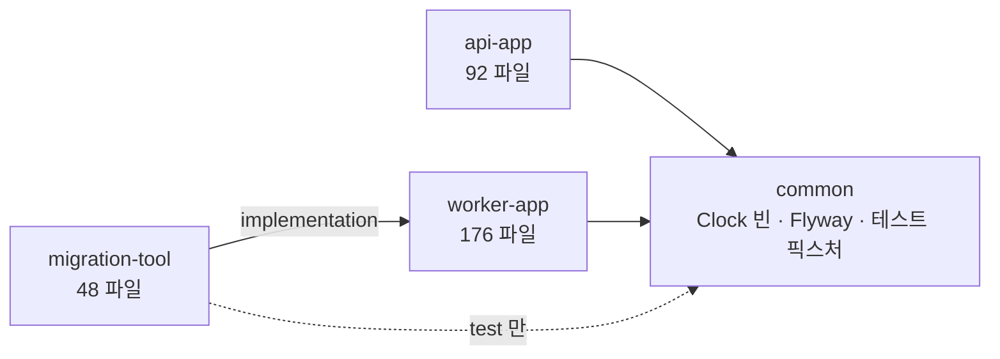
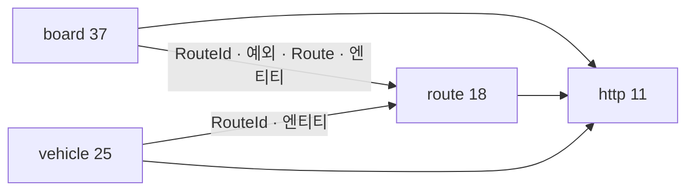
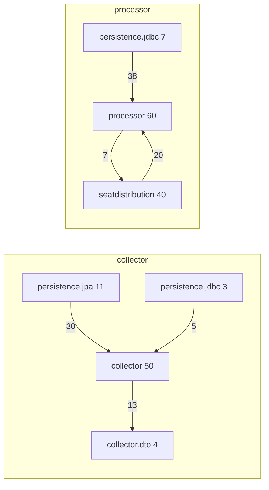
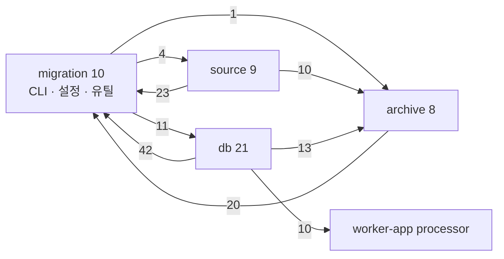

# 01. 구조 현황

기준 `dev` 6f70826. 경로는 `backend/` 기준이고, `src/main/java/com/gustler/backend/` 는 `…/` 로 줄였다.

## 1. 모듈

| 모듈 | 역할 | main 파일 / 줄 | test 파일 / 줄 | 의존 |
| --- | --- | --- | --- | --- |
| common | `ClockConfig` 1개, Flyway `V1~V14`, testFixtures 3개(`IntegrationTest`, `PostgresTestContainer`, `TimeSourceRules`) | 1 / 15 | 8 / 1,082 (+fixtures 3 / 59) | `api 'spring-context'` |
| api-app | 클라이언트 API(8080). `/routes`, `/routes/{id}/board`, `/routes/{id}/vehicles` | 92 / 3,331 | 30 / 3,782 | common |
| worker-app | 수집·예보·회수·통계 배치(8081) | 176 / 11,330 | 87 / 15,455 | common |
| migration-tool | S3 과거 관측 → RDS 이관 CLI | 48 / 12,543 | 18 / 3,769 | worker-app(implementation), common(test만, testFixtures 아님) |

- api-app 과 worker-app 사이에는 코드 의존이 없다. 초기 설계 문서가 ArchUnit 으로 막겠다던 "api 가 processor 를 부른다"는 PR #53(SAL-118, 2026-09-01) 의 모듈 분리로 물리적으로 막혔다.
- migration-tool 은 worker-app 의 `processor` 클래스 10개를 직접 쓴다(§3-4). CLI 가 boot 앱을 라이브러리로 쓰는 셈이다.
- common 은 사실상 비어 있다. 두 앱이 함께 쓰는 값(서울 시간대, 신선도 5분)은 각자 갖고 있다(§8).

## 2. 패키지 트리

### api-app

기능(board·route·vehicle) 아래 계층(controller·application·domain·dto·persistence.jpa)이 오는 2단 구조다. 기능 루트에는 예외와 `RouteId` 가 있다. `http` 는 오류 응답·요청 식별자 같은 공통 층이다.

| 패키지 | 파일 | 줄 | 담는 것 |
| --- | --- | --- | --- |
| `…/api/http` | 11 | 597 | `ApiException`, `ErrorCode`, `ApiExceptionHandler`, `ApiErrorController`, `ContainerErrorResponseValve`, `RequestIdFilter`, `ErrorHeaders`(package-private) |
| `…/api/board` | 2 | 29 | `ModelOutOfScopeException`, `NoRecentObservationException` |
| `…/api/board/controller` | 1 | 32 | `BoardController` |
| `…/api/board/application` | 9 | 500 | `BoardQueryService`(330), `BoardQueryRepository`(포트), `BoardCachePolicy`, `BoardFreshnessPolicy`, 읽기 모델 record 5개 |
| `…/api/board/domain` | 8 | 147 | `Board`, `BoardRoute`, `BoardStop`, `StopState`, `ApproachingVehicle`, `DirectionInfo`, `ForecastModel`, `BoardDirection` |
| `…/api/board/dto` | 6 | 161 | `*Response` record 6개 |
| `…/api/board/persistence/jpa` | 11 | 458 | `JpaBoardQueryRepository`, Spring Data 인터페이스 4개, 엔티티 4개, ID 2개 |
| `…/api/route` | 3 | 38 | `RouteId`, `InvalidRouteIdException`, `RouteNotFoundException` |
| `…/api/route/application` | 3 | 52 | `RouteQueryService`, `RouteQueryRepository`, `RouteOverview` |
| `…/api/route/{controller,domain,dto}` | 1+2+2 | 128 | |
| `…/api/route/persistence/jpa` | 7 | 252 | `JpaRouteQueryRepository`, 엔티티 3개, 인터페이스 2개, `ModelDeploymentState` |
| `…/api/vehicle/application` | 6 | 244 | `LiveVehicleQueryService`(129), `VehicleQueryRepository`, 정책 2개, 읽기 모델 2개 |
| `…/api/vehicle/{controller,domain,dto}` | 1+6+4 | 284 | `VehicleSeat`·`SeatResponse` 는 sealed 인터페이스 |
| `…/api/vehicle/persistence/jpa` | 8 | 396 | `JpaVehicleQueryRepository`, 엔티티 3개, ID 1개, 인터페이스 3개 |

### worker-app

두 컨텍스트 `collector`·`processor` 가 각각 한 패키지에 평면으로 있고, 그 아래 `persistence.jpa`·`persistence.jdbc` 가 있다. `collector.dto` 는 상류(GBIS) 응답 형이고, `processor.seatdistribution` 은 모델 구현이다.

| 패키지 | 파일 | 줄 | 담는 것 |
| --- | --- | --- | --- |
| `…/collector` | 50 | 2,355 | 수집 잡·장부·상류 호출·노선 판본·관측 값·포트 5개·설정 2개 |
| `…/collector/dto` | 4 | 219 | `BusLocationResponse`, `BusRouteInfoResponse`, `BusRouteStationResponse`, `PortalErrorResponse` |
| `…/collector/persistence/jpa` | 11 | 716 | `JpaObservationRepository`, `JpaRouteVersionRepository`, 엔티티 4개, Spring Data 인터페이스 4개, ID 1개 |
| `…/collector/persistence/jdbc` | 3 | 146 | `JdbcCallQuotaRepository`, `JdbcCurrentRouteVersionRepository`, `JdbcRouteRegistry` |
| `…/processor` | 60 | 3,383 | 예보·회수·통계 잡, 값 record 40여 개, 포트 8개, 설계행렬 |
| `…/processor/seatdistribution` | 40 | 2,855 | 계수 번들 적재·검증, 예측기, `RuntimeSnapshot`, `Sha256`(package-private) |
| `…/processor/persistence/jdbc` | 7 | 1,643 | `Jdbc*Repository` 7개, 전부 `JdbcClient` |

### migration-tool

이관 단계로 나뉜다. 루트에 CLI 와 공용 유틸이 같이 있다.

| 패키지 | 파일 | 줄 | 담는 것 |
| --- | --- | --- | --- |
| `…/migration` | 10 | 1,130 | `MigrationCli`(349), `CliArguments`, `ApprovalGate`, `Configuration`, `DatabaseEnvironment`, `MigrationException`, `CanonicalJson`, `Sha256`, `SecureFiles`, `OutputStreams` |
| `…/migration/source` | 9 | 2,007 | S3 읽기·검증·내보내기. `SourceObjectStore`(포트) ← `AwsSourceObjectStore` |
| `…/migration/archive` | 8 | 1,734 | 중간 파일 형식·검증·zstd 샤드 |
| `…/migration/db` | 21 | 7,672 | RDS 적재·검증·롤백·시드 전환. 800줄 넘는 파일 4개 |

## 3. 의존 방향

### 3-1. api-app

기능 사이는 board → route, vehicle → route 한 방향이다. 모든 기능이 `http` 에 의존하고 `http` 는 기능을 모른다.

기능 안 계층 간선(간선 수는 import 수).

| from → to | board | route | vehicle | 비고 |
| --- | --- | --- | --- | --- |
| controller → application, dto | 2+1 | 1+1 | 2+1 | 컨트롤러가 persistence·domain 을 직접 안 본다 |
| application → domain | 12 | 5 | 7 | |
| dto → domain | 8 | 2 | 5 | `*Response.from(domain)` |
| dto → application | 0 | 1 | 2 | 읽기 모델을 그대로 응답에 옮기는 곳 |
| persistence.jpa → application | 7 | 1 | 2 | 포트와 읽기 모델이 application 에 있다 |
| persistence.jpa → domain | 5 | 3 | 6 | 엔티티의 `toDomain()` |
| persistence.jpa → 다른 기능의 persistence.jpa | 8 (→route) | – | 4 (→route) | `RouteVersionJpaEntity`, `ModelDeploymentJpaEntity` 재사용 |
| persistence.jpa → http | 1 | 1 | 1 | `ServiceUnavailableException` 을 어댑터에서 던진다 |
| application → http | 1 | 0 | 0 | `BoardQueryService` 가 `ServiceUnavailableException` 을 던진다 |

### 3-2. worker-app

- collector ↔ processor 간선 0. `PackageBoundaryTest` 가 양방향을 막고 있고 실측도 0이다.
- processor ↔ seatdistribution 은 양방향이다(§4).
- 어댑터(`persistence.*`)는 포트가 있는 패키지만 본다. 어댑터끼리의 의존은 없다.

### 3-3. migration-tool

루트가 진입점(`MigrationCli` → 세 하위 패키지)이면서 유틸(`CanonicalJson`, `Sha256`, `MigrationException`, `Configuration`, `SecureFiles` ← 세 하위 패키지)이라 양방향이 된다.

### 3-4. migration-tool → worker-app

| migration-tool 클래스 | 쓰는 processor 클래스 |
| --- | --- |
| `db.AggregateSeedReader`, `db.TemporaryReleaseMaintenance` | `StopDemandStatisticsJob`(`CURRENT_CALCULATION_VERSION` 상수) |
| `db.AggregateSeedCutover` | `StopDemandAggregator`, `StopDemandHourlyTotals`, `StopDemandMeasurement` |
| `db.RdsObservationDeltaBuilder` | `ArrivalLabel`, `ArrivalLabelResolver`, `ArrivalCandidate`, `ObservedVehicle`, `PendingForecast` |

집계·라벨 규칙을 두 번 구현하지 않으려고 worker-app 의 순수 계산 클래스를 그대로 쓴 것이다. 대신 processor 의 이 클래스들은 이제 이름·패키지를 바꾸면 migration-tool 도 같이 고쳐야 한다.

## 4. 순환

### 4-1. 패키지 순환 2건

| 순환 | 간선 | 원인 클래스 |
| --- | --- | --- |
| `processor` ↔ `processor.seatdistribution` | 7 / 20 | processor → seatdistribution: `ForecastRuntime`·`ForecastJob`·`ForecastBatchWriter` 가 `RuntimeSnapshot` 을, `SeatForecastInput`·`SameDayFullOutcomesService`·`SameDayFullOutcomeCount` 가 `SameDayFullOutcomes` 를 쓴다. seatdistribution → processor: `SeatDistributionForecastModel`·`ActiveForecastRuntimeResolver`·`BundleActivation`·`LoadedBundle` 등 10개 클래스가 포트·값 10개를 쓴다 |
| `migration` ↔ `migration.{archive, db, source}` | 4+1+11 / 23+20+42 | 위 §3-3. 루트가 진입점과 유틸을 겸한다 |

processor 쪽은 포트(`ForecastRuntime`)의 반환형(`RuntimeSnapshot`)과 재료 record 의 구성 요소(`SameDayFullOutcomes`)가 구현 패키지에 있어 생겼다. 두 record 와 `SupportedForecastScope` 를 processor 로 올리면 간선 7개가 사라지고 순환이 풀린다. `SupportedForecastScope.digest()` 가 seatdistribution 의 package-private `Sha256` 을 쓰므로 그것도 같이 옮겨야 한다(04 §2-1).

현재 배치는 PR #53 에서 생겼다. seatdistribution 은 PR #50(SAL-93) 에서 들어왔고 #53 이 지금 경로로 옮겼다.

### 4-2. 클래스 순환 2건 (같은 패키지 참조 포함)

| 순환 | 원인 |
| --- | --- |
| `source.SourceAcceptancePolicy` ↔ `source.SourceArchiveExporter` | `SourceAcceptancePolicy.matches(SourceArchiveExporter.Accumulator)` 가 내보내기 클래스의 중첩형을 받는다 |
| `db.AggregateSeedCutover` ↔ `db.TemporaryReleaseMaintenance` ↔ `db.RdsObservationDeltaBuilder` | `TemporaryReleaseMaintenance.CutoverBoundary` 중첩 record 를 둘이 받고, `TemporaryReleaseMaintenance` 는 `AggregateSeedCutover` 의 정적 메서드 3개를 부른다 |

api-app·worker-app 에는 클래스 순환이 없다. 클래스 순환은 컴파일에 문제가 없지만 셋 중 하나를 옮기거나 테스트하려면 나머지가 따라온다.

## 5. 클래스 수와 크기

main 파일 줄 수 분포.

| 줄 | 파일 수 |
| --- | --- |
| ≤ 20 | 70 |
| 21–50 | 116 |
| 51–100 | 65 |
| 101–200 | 36 |
| 201–400 | 18 |
| > 400 | 12 |

400줄 넘는 12개 중 10개가 migration-tool 이다. api-app 의 최대는 `BoardQueryService` 330줄, worker-app 은 `JdbcStopDemandStatisticsRepository` 436줄·`JdbcVehicleTrajectoryRepository` 399줄이다.

| 파일 | 줄 | 모듈 |
| --- | --- | --- |
| `db.AggregateSeedCutover` | 1,134 | migration-tool |
| `db.TemporaryReleaseMaintenance` | 890 | migration-tool |
| `db.SeedCutoverVerifier` | 846 | migration-tool |
| `db.RdsObservationDeltaBuilder` | 771 | migration-tool |
| `source.SourceRecordValidator` | 645 | migration-tool |
| `source.SourceArchiveExporter` | 563 | migration-tool |
| `db.ArchiveStager` | 561 | migration-tool |
| `archive.ArchiveManifest` | 555 | migration-tool |
| `db.ArchiveMerger` | 524 | migration-tool |
| `db.RouteBinder` | 501 | migration-tool |
| `processor.persistence.jdbc.JdbcStopDemandStatisticsRepository` | 436 | worker-app |
| `db.AggregateSeedReader` | 416 | migration-tool |

형 선언(중첩 포함)은 record 238, class 156, interface 48, enum 32 다. sealed 인터페이스는 16개(worker 9, migration 5, api 2)다. 중첩형은 migration.db 에 90개가 몰려 있다(`RdsObservationDeltaBuilder` 15, `AggregateSeedCutover` 10, `TemporaryReleaseMaintenance` 9).

테스트 쪽 큰 파일은 `ForecastJobTest` 678, `JdbcVehicleTrajectoryRepositoryTest` 626, `JdbcStopDemandStatisticsRepositoryTest` 620, `RouteBinderTest` 588, `SourceExportAcceptanceGateTest` 523 줄이다.

## 6. 계층 명명의 일관성

역할별로 어느 이름·패키지를 쓰는지 모듈끼리 대조한 표다.

| 역할 | api-app | worker-app | migration-tool |
| --- | --- | --- | --- |
| 진입점 | `controller/*Controller` | `*Job`(`@Scheduled`), `CollectionScheduler`, `BundleStartupLoader`(`@EventListener`) | `MigrationCli` |
| 응용 로직 | `application/*QueryService`, `*Policy` | 평면. `*Ledger`, `*Loader`, `*Collector`, `*Writer`, `*Resolver`, `*Assembler`, `*Aggregator`, `*Service`(1개) | `*Exporter`, `*Stager`, `*Merger`, `*Verifier`, `*Reconciler`, `*Rollback`, `*Cutover`, `*Maintenance` |
| 도메인 값 | `domain/` record·enum·sealed | 평면 record·enum·sealed | `archive/` record |
| 읽기 모델 | `application/` record(`BoardSnapshot` 등) | 평면 record(`PendingForecastBatch` 등) | 중첩 record |
| 포트 | `application/*QueryRepository` | `*Repository`, `RouteRegistry`, `ForecastRuntime`, `SeatForecastModel`, `CoefficientLookup` | `SourceObjectStore` |
| 어댑터 | `persistence/jpa/Jpa*QueryRepository` | `persistence/jpa/Jpa*Repository`, `persistence/jdbc/Jdbc*Repository` | `db/*`(DriverManager 직결), `source/AwsSourceObjectStore` |
| Spring Data 인터페이스 | `*EntityRepository`(9개) | `Collector*Repository`(2개), `*EntityRepository`(2개) | 없음 |
| JPA 엔티티 | `*JpaEntity`, `*JpaId`. board 만 `@Entity(name=…)` 지정 | `*JpaEntity`, `@Entity(name="Collector…")` 전부 지정 | 없음 |
| 응답/요청 DTO | `dto/*Response`(나가는 응답) | `collector/dto/*Response`(들어오는 상류 응답) | – |
| 예외 | `http/ApiException` + 기능 루트의 하위 예외 | `collector/ForecastAlreadyCompletedException`, `seatdistribution/BundleRejectedException` | `MigrationException(code)` |
| 설정 | `http/ContainerErrorResponseConfig` | 기능 옆 `*Config` 4개 + `*Properties` record 4개 | `Configuration`(파일 로더) |

같은 접미사가 반대 뜻으로 쓰이는 곳이 하나 있다. `*Response` 가 api-app 에서는 우리가 내는 응답이고 worker-app 에서는 상류가 준 응답이다. 같은 단순 이름이 두 컨텍스트에 따로 있는 것은 넷이다(`RouteStop`, `RouteStops`, `RouteVersionRepository`, `SeatUnknownReason`). processor 쪽 javadoc 이 "collector 의 코드를 부르지 않는다. 같은 route_stop 을 읽어도 형이 따로 있다"고 이유를 적어 두었다.

## 7. 설정 클래스 위치

| 클래스 | 위치 | 역할 |
| --- | --- | --- |
| `ClockConfig` | common `config/` | `Clock.system(Asia/Seoul)` 빈 |
| `ContainerErrorResponseConfig` | api `http/` | 톰캣 오류 valve |
| `CollectionConfig`(+중첩 `ScheduledCollection`) | worker `collector/` | `@EnableScheduling`, 적응형 트리거 등록, `@ConditionalOnProperty` |
| `GbisClientConfig` | worker `collector/` | `RestClient` 빈 |
| `ForecastScheduleConfig` | worker `processor/` | `@EnableScheduling`, `ForecastProperties` 등록 |
| `ForecastRuntimeConfig` | worker `processor/seatdistribution/` | `LoadedBundleHolder`, `BundleActivation`, `ActiveForecastRuntimeResolver` 빈 |
| `GbisProperties`, `CollectionProperties`, `ForecastProperties`, `ModelBundleProperties` | 각 기능 패키지 | `@ConfigurationProperties` record, compact 생성자에서 검증 |

설정은 `config` 패키지에 모으지 않고 기능 옆에 둔다. common 만 `config` 패키지를 쓴다. 두 앱의 `application.yml` 은 각 모듈 `src/main/resources` 에 있고, `@EnableScheduling` 이 두 설정 클래스에 각각 붙어 있다.

## 8. 모듈 간 중복

### 8-1. 같은 표를 매핑한 엔티티

| 표 | 클래스 | 차이 |
| --- | --- | --- |
| `observation_batch` | api board, api vehicle, worker collector | 매핑 컬럼이 다르다(board 는 `forecast_completed_at`·`stored_rows`, vehicle 은 `scheduled_at`·`attempt_number`). board 는 `toDomain(ZoneId)`, vehicle 은 접근자, worker 는 `markDispatching`·`conclude`·`reopen` 행동을 가진다 |
| `route_stop` | api board, api vehicle, worker collector | board 는 `boarding_allowed` 를 읽고 `BoardDirection`, vehicle 은 `VehicleDirection` 을 쓴다 |
| `vehicle_observation` | api board(41줄), api vehicle(83줄), worker collector(119줄) | vehicle 만 `route_stop` 을 `@JoinColumns` 로 조인한다 |
| `route_version` | api route, worker collector | |
| `RouteStopJpaId` | 3벌 | board 는 `@EqualsAndHashCode`, vehicle 은 손으로 쓴 `equals`, worker 는 record |

초기 설계 문서(§10)가 "api 안에서 예보와 차량을 갈라 읽는다 — projection 이 둘이고 표를 공유하지 않는다"고 정했다. 그러니 이것은 복사가 아니라 조회마다 다른 투영이다. 다만 ID 클래스 3벌과 컬럼명 문자열은 실제 중복이고, 커밋 "fix: 같은 표를 매핑한 엔티티의 논리 컬럼명을 맞춘다 (#36)" 가 그 비용을 한 번 치렀다.

### 8-2. 유틸과 상수

| 항목 | 위치 | 비고 |
| --- | --- | --- |
| `Sha256` | `processor.seatdistribution.Sha256`(package-private, 33줄), `migration.Sha256`(public, 69줄) | 둘 다 `HexFormat` 으로 소문자 hex. migration 쪽은 파일 해시·검증 메서드가 더 있다 |
| `ZoneId.of("Asia/Seoul")` | 14 파일(common 1, api 2, worker 2, migration 9) | `SeoulDay`, `CallQuotaLedger.KOREA` 처럼 이름을 붙인 곳과 그 자리에서 만드는 곳이 섞여 있다. SQL 에도 `AT TIME ZONE 'Asia/Seoul'` 3곳 |
| 신선도 5분 | api `BoardFreshnessPolicy.FRESHNESS_WINDOW`, worker `forecast.staleness`(yml) | yml 주석이 "모듈이 갈려 상수를 안 나눠 쓰니 한쪽만 고치면 조용히 어긋난다"고 적어 두었다 |
| 표 이름을 SQL 문자열에 직접 | worker jdbc 10개 클래스, migration-tool 9개 클래스 | `observation_batch`, `vehicle_observation`, `seat_forecast`, `route_version`, `route`, `route_stop`, `model_deployment`, `stop_demand_statistics`, `stop_demand_seed_import` 9개 표가 두 모듈 SQL 에 모두 나온다 |
| 동일 줄 60자 이상 | 3줄 | `stop_demand_statistics` 컬럼 목록 2줄, 길이 접두 해시 1줄 |

### 8-3. 테스트 기반

| 항목 | 상태 |
| --- | --- |
| 컨테이너 | common testFixtures `PostgresTestContainer`(`@ServiceConnection`) 를 api·worker·common 이 쓴다. migration-tool 은 `PostgresMigrationTestSupport` 로 `PostgreSQLContainer` 를 직접 띄운다 |
| 픽스처 상수 | `NORMALIZATION_VERSION` 13 파일, `RUNNING_STATE_DEPARTED` 14, `SOURCE_ID = "GBIS"` 14, `ROUTE_204000057` 14, `CONTENT_DIGEST` 12, `COLLECTION_STRATEGY_VERSION` 8 파일이 각자 선언한다 |
| DB 픽스처 | `INSERT INTO route` 를 직접 쓰는 테스트 파일 23개. api 는 `BoardDatabaseFixture` 로 묶었고 worker 는 테스트마다 private 메서드다 |

## 9. 변경 이력

- backend 커밋 33개(전부 squash merge). 작성자는 korogoo 23, Dongkey 10.
- 구조를 바꾼 커밋은 PR #53(SAL-118, 2026-09-01) 하나다. 392개 파일 이동으로 boot 앱 둘과 common 을 갈랐다. migration-tool 은 PR #61(SAL-122, 2026-09-03) 에서 들어왔다.
- 자주 바뀐 main 파일은 `JdbcVehicleTrajectoryRepository` 4회, `HistoricalSchema` 3회이고, 나머지는 2회 이하다. 코드가 8월 말~9월 초에 한 번에 들어와서 변경 빈도로 뜨거운 곳을 가리기엔 이르다.
- 열린 BE PR 은 없다(2026-09-21 기준 열린 PR 은 FE #68, #69). PR #67 은 병합됐고 기준 커밋에 들어 있다.

## 10. 초기 설계 문서와 대조

컨플루언스 「0817 BE 객체 구조 — 패키지 3 · 객체 54」(V8, korogoo, 2026-08-17) 가 설계 원본이다.

| 항목 | 설계(V8) | 현재 |
| --- | --- | --- |
| 패키지 | collector 20 · processor 20 · api 14 = 54 | collector 68 · processor 107 · api 91 · migration 48 · common 1 = 315 (main 최상위 형, Application 클래스 2개 제외) |
| 경계 | 프로세스 둘(배치·요청), 패키지끼리 못 부름, ArchUnit 이 CI 에서 막음 | 모듈 셋(+CLI). collector↔processor 는 ArchUnit, api↔worker 는 모듈 의존으로 막힘 |
| 상류 호출 포트 | `RealtimeObservationSource`, `RouteReferenceSource` 인터페이스 | `GbisLocationSource`, `GbisRouteSource` 구체 클래스. 테스트는 `MockRestServiceServer`·`HttpServer` 로 상류를 흉내 낸다 |
| 모델 인터페이스 | `FullnessProbabilityModel` + sealed `PredictionResult` | `SeatForecastModel` + record `SeatForecastResult`. 결과 sealed 는 `ArrivalLabel` 쪽에 남았다 |
| 계수 적재 | `CoefficientSource` 인터페이스 | `CoefficientLookup` 인터페이스 + `BundleLoader` 정적 메서드 |
| api 조회 | `JdbcClient` 기반 `BoardQuery`·`LiveVehicleQuery` | JPA 엔티티 + Spring Data. 두 투영이 표를 공유하지 않는 원칙은 유지 |
| 예보 방식 | 시간대 경계마다 발행본 | 관측 batch 마다 예보 행. 설계와 가장 많이 달라진 부분이고 processor 가 5배 커진 이유 |

설계 문서의 "요구가 바뀌면 몇 개가 열리나" 표(모델 교체 0줄, 상류 필드명 변경 1곳, 화면 항목 추가 api 2개)는 지금도 유효한 판정 기준이다. 04 제안서의 구조 후보는 이 기준을 유지하는지로도 비교했다.
