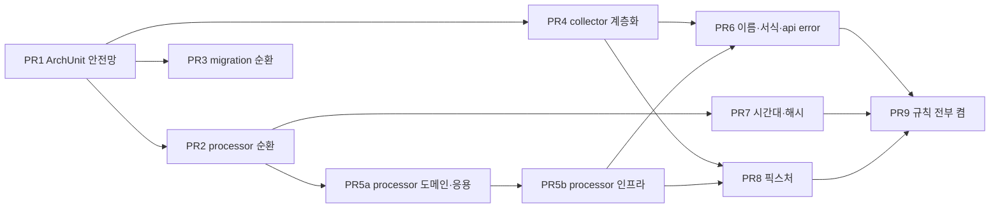

# 04. 제안서 — 구조 원칙, 컨벤션 초안, 이관 계획

기준 `dev` 6f70826. 여기 적은 것은 제안이고 결정은 §6 갈림길에서 팀이 한다. 이관 PR 은 전부 동작 변경이 없어야 하고 기능 변경과 섞지 않는다. 팀 제안(도메인 주도 계층)의 검토는 [05](05-도메인주도-계층안-검토.md) 에 있고, 그 결과로 이 문서의 추천안을 D안으로 갱신했다.

## 1. 요약

- 추천은 **D안(컨텍스트 → 계층 → 도메인 개념)**이다. collector·processor 를 `domain`·`application`·`infrastructure`·`config` 로 나누고 `domain` 아래를 개념별로 나눈다. api-app 은 이미 이 모양이라 이름 대응표만 두고, migration-tool 은 순환만 푼다. D안이 부담이면 B안(개념 분할만)으로 후퇴한다. 두 안의 개념 분할은 같다.
- 컨벤션은 25개 규칙 초안이고 그중 13개는 ArchUnit 으로 고정할 수 있다. D안이 규칙 3개(계층 방향, 도메인 순수성, 상류 호출 포트)를 더한다.
- 이관은 PR 10개(선택 2개 별도)다. PR 1(ArchUnit 안전망)이 먼저이고, 순환 해소 2개는 서로 독립이며, 계층화 3개는 그 뒤다.

## 2. 구조 원칙 후보

### 2-1. A안 — 현상 유지 + 순환만 해소 + 규칙 고정

패키지는 안 옮기고 01 §4 의 순환 2건과 클래스 순환 2건만 푼다.

```
worker-app
  processor/                 RuntimeSnapshot, SameDayFullOutcomes, SupportedForecastScope 가 seatdistribution 에서 올라온다
  processor/seatdistribution Sha256 → common 으로
migration-tool
  migration/                 유틸만 남는다: Configuration, DatabaseEnvironment, MigrationException, CanonicalJson, Sha256, SecureFiles, OutputStreams
  migration/cli/             MigrationCli, CliArguments, ApprovalGate
  migration/source/          SourceAcceptancePolicy.matches 가 받는 Accumulator 를 독립 record 로
  migration/db/              CutoverBoundary 를 독립 record 로
```

| | 내용 |
| --- | --- |
| 장점 | 이동 파일 10개 안쪽, PR 2개. 규칙(`slices().beFreeOfCycles()`)을 바로 켤 수 있다 |
| 단점 | collector 50·processor 60 평면이 그대로다. package-private 을 쓸 자리가 안 생기고 새 클래스의 소속이 계속 이름에만 의존한다 |
| 이관 비용 | main 이동 7, 수정 약 20, test 수정 약 10 |

### 2-2. B안 — 모듈 안 기능별 하위 패키지

A안을 포함한다. worker-app 의 두 컨텍스트를 실측으로 순환이 없는 배정으로 나눈다. 괄호는 파일 수, 화살표는 클래스 의존 그래프에서 실제로 잰 방향이다.

```
com.gustler.backend
├─ collector
│  ├─ gbis (10)        GbisApiCaller, GbisClientConfig, GbisProperties, GbisLocationSource, GbisRouteSource,
│  │                   GbisLocationResult, GbisRouteResult, GbisRawResponse, GbisResultCode, PortalReasonCode
│  │  └─ dto (4)       그대로
│  ├─ upstream (12)    UpstreamRoute, UpstreamRouteStop, UpstreamObservationRow, RouteStop, RouteStops, RouteTimetable,
│  │                   StopDirection, VehicleObservation, RemainingSeats, SeatUnknownReason, CollectedObservations, BoardingPolicy
│  ├─ quota (3)        CallQuota, CallQuotaLedger, CallQuotaRepository
│  ├─ route (9)        RouteCatalogLoader, RouteVersionLoader, RouteRegistry, RouteVersionRepository, CurrentRouteVersionRepository,
│  │                   RouteContentDigest, RouteVersionContent, RouteVersionDecision, StoredRouteVersion
│  ├─ batch (10)       ObservationCollector, ObservationBatchLedger, ObservationLoader, ObservationRepository, ObservationAttempt,
│  │                   ObservationBatchConclusion, ObservationBatchFailureCode, ObservationBatchOutcome, ObservationBatchReservation,
│  │                   ForecastAlreadyCompletedException
│  ├─ schedule (6)     CollectionConfig, CollectionScheduler, CollectionSchedule, CollectionPhase, CollectionProperties, AdaptiveCollectionTrigger
│  └─ persistence/jpa (11) · persistence/jdbc (3)   그대로
└─ processor
   ├─ job (6)          ForecastJob, ForecastBatchWriter, ArrivalLabelJob, StopDemandStatisticsJob, ForecastScheduleConfig, ForecastProperties
   ├─ forecast (11)    SeatForecast, SeatForecastInput, SeatForecastModel, SeatForecastResult, SeatForecastRepository, SeatForecastDesignMatrix,
   │                   SeatDistribution, FullChanceCoefficients, ForecastRuntime, ForecastTimeSlot, RuntimeSnapshot(←seatdistribution)
   ├─ settlement (8)   ArrivalLabelResolver, ArrivalLabel, ArrivalCandidate, ArrivalObservationRepository, ForecastSettlement,
   │                   SettledForecast, PendingForecast, ScoringState
   ├─ sameday (5)      SameDayFullOutcomesService, SameDayFullOutcomesRepository, SameDayFullOutcomeCount, SeoulDay, SameDayFullOutcomes(←seatdistribution)
   ├─ demand (9)       StopDemandStatistics, StopDemandStatisticsRepository, StopDemandAggregator, StopDemandCell, StopDemandGeneration,
   │                   StopDemandHourlyTotals, StopDemandMeasurement, TargetStopDemand, TimeSlot
   ├─ trajectory (14)  VehicleTrajectory, VehicleTrajectoryAssembler, VehicleTrajectoryRepository, TrajectoryObservation, TrajectoryGap,
   │                   ObservationHistory, ObservedBatch, ObservedVehicle, ObservedSeats, PrecedingVehicle, FullSeatStreak, SeatSlope,
   │                   PendingForecastBatch, SeatUnknownReason
   ├─ route (6)        RouteStop, RouteStops, RouteVersionRepository, StopPositionOnRoute, ForecastDistance, VehicleStopTarget
   ├─ deployment (4)   ActiveModelDeployment, StagedModelDeployment, ModelDeploymentRepository, SupportedForecastScope(←seatdistribution)
   ├─ seatdistribution (37)   그대로. 모델 구현
   └─ persistence/jdbc (7)    그대로
```

실측 방향(클래스 의존 그래프를 위 배정으로 접은 것. 숫자는 간선 수).

| from → to | collector | processor |
| --- | --- | --- |
| 진입 | schedule → batch 1, gbis 1 | job → forecast 9, demand 7, settlement 6, route 5, trajectory 5, sameday 3 |
| 핵심 | batch → gbis 5, upstream 3, quota 2, route 1, dto 1 | forecast → trajectory 6, demand 5, route 5, settlement 3, deployment 2, sameday 1 |
| 아래층 | route → upstream 10, gbis 2, quota 2 · gbis → upstream 5, dto 5 · quota → gbis 1 · upstream → dto 2 | sameday → settlement 2 · settlement → route 1, trajectory 1 · route → trajectory 2 · demand → route 1 · deployment → route 1 |
| 모델 구현 | – | seatdistribution → forecast 10, deployment 10, sameday 2 |
| 어댑터 | jpa → upstream 12, batch 10, route 5, schedule 1 · jdbc → quota 2, route 2, upstream 1 | jdbc → trajectory 11, settlement 8, demand 7, route 3, sameday 3, deployment 3, forecast 2, job 1 |
| 순환 | 없음 | `deployment.SupportedForecastScope → seatdistribution.Sha256` 하나. `Sha256` 을 common 으로 올리면 없음 |

첫 배정에서는 값 형(`TimeSlot`, `ForecastDistance`, `VehicleStopTarget`, `PendingForecastBatch`)이 `forecast` 에, 잡이 각 기능에 섞여 있어 10개 묶음이 한 덩어리로 묶였다. 값 형을 아래로, 잡을 위로 옮기니 풀렸다. 평면 패키지가 숨기던 방향이 나눌 때 드러난다.

| | 내용 |
| --- | --- |
| 장점 | 패키지당 14 파일 이하. 새 클래스의 자리가 정해진다. `slices().matching("..processor.(*)..").should().beFreeOfCycles()` 로 방향을 고정한다 |
| 단점 | 개념 패키지 안에 잡·값·포트·설정이 섞인다. api-app 과 모양이 다르다 |
| 이관 비용 | main 이동 113, test 이동 52, import 수정 main 약 65·test 약 32 |

### 2-3. C안 — 도메인 모듈 분리 + 헥사고날 완전형

```
backend
├─ common            Clock, KoreaTime, Sha256, 신선도 상수
├─ domain            collector·processor 의 값 형과 포트 (Spring 의존 없음)
├─ persistence       두 앱이 공유하는 JPA 엔티티·Spring Data (api 투영 3벌 → 1벌)
├─ api-app           adapter/in/web, application/port/in (유스케이스 인터페이스)
├─ worker-app        adapter/out/persistence, adapter/out/gbis, application/port/out
└─ migration-tool
```

| | 내용 |
| --- | --- |
| 장점 | 중복 제거(엔티티 3벌, `Sha256` 2벌, 시간대 14곳, 5분 상수). 포트·어댑터 이름이 교과서와 같다 |
| 단점 | 모듈 경계 변경은 `build.gradle` 6개, `buildspec.yml` 의 bootJar 둘, Testcontainers 35 클래스의 컨텍스트에 닿는다. api 의 투영 엔티티를 worker 엔티티에 묶으면 설계 문서의 "두 조회가 표를 공유하지 않는다"와 조회 최적화 자유도를 잃는다. 포트마다 구현이 하나라 `port.in/out` 층은 파일만 는다. PR 10개 넘고 4인 팀 규모를 넘는다 |
| 이관 비용 | main 전 파일의 절반 이상 이동, 모듈 추가 2, 빌드·배포 설정 변경 |

### 2-4. D안 — 컨텍스트 → 계층 → 도메인 개념 (추천)

팀 제안이다. B안의 개념 분할을 `domain` 아래에 그대로 두고 `application`·`infrastructure`·`config` 를 한 단으로 올린다. 트리·실측·위반·규칙은 05 §3~§5 에 있다. 요지만 적는다.

```
collector/  domain/{upstream, gbis, gbis.dto, batch, route, quota, schedule} · application · infrastructure/{gbis, persistence.jpa, persistence.jdbc} · config
processor/  domain/{forecast, settlement, sameday, demand, trajectory, route, deployment} · application · infrastructure/{model, persistence.jdbc} · config
api/        지금 구조 유지. controller+dto = presentation, application, domain(+기능 루트), persistence.jpa = infrastructure. http → error(계약) + http(처리) 로 분리
```

| | 내용 |
| --- | --- |
| 장점 | 도메인 계층이 실측으로 이미 순수하다(후보 92개 중 Spring·JPA import 0). 계층 방향·도메인 순수성 규칙을 ArchUnit 으로 건다. api-app 과 같은 모양이라 백엔드 전체가 한 어휘를 쓴다. 팀이 낸 안이라 이름 합의가 빠르다 |
| 단점 | 경로가 한 단 깊다. 위반 5건을 같이 고쳐야 한다(전부 이동, 05 §4). 전술 패턴까지 밀면 processor 의 SQL 집합 처리 설계와 부딪히므로 계층까지로 선을 긋는다 |
| 이관 비용 | main 이동 175(worker) + 4(api error), 상류 호출 포트 신설 2, 상수 이동 2, test 이동 84. `persistence`·`seatdistribution` 경로를 `infrastructure` 아래로 안 옮기면 main 154·test 76 |

## 3. 추천안과 근거

D안이다.

1. 순환 2건과 크기 문제(평면 110 파일)를 같이 푼다. A안은 크기를 안 풀고 C안은 배포 구성까지 흔든다.
2. 실측으로 성립한다. 개념 사이 순환 없음, 도메인 순수성 위반 0(Jackson DTO 4개는 예외 규정), 계층 위반 5건은 전부 이동으로 풀린다(05 §4).
3. 동작 변경이 없다. 이동·인터페이스 추출·import 뿐이라 테스트가 그대로 검증한다.
4. 규칙이 셋으로 는다. 슬라이스 순환에 계층 방향과 도메인 순수성이 더해져, "DB 를 안 탄다"고 javadoc 으로만 적어 두던 것이 빌드에서 검사된다.
5. api-app 을 안 옮기고도 같은 모양이 된다. 팀원 둘이 나눠 만든 두 앱 중 한쪽만 옮기므로 충돌 면이 작다.

이름은 제안이다. `upstream`(상류에서 받아 정규화한 값), `sameday`(당일 성적), 계층 이름 `domain`·`application`·`infrastructure`·`config` 는 §6 에서 정한다. 개념 분할이 부담스러우면 B안으로 후퇴하되 개념 분할은 같다.

## 4. 컨벤션 초안

"근거" 는 02 의 실측이다. "ArchUnit" 칸의 ✔ 는 규칙으로 고정 가능, △ 는 부분만 가능, ✖ 는 리뷰로만 지킨다.

| # | 규칙 | 근거(현황) | ArchUnit |
| --- | --- | --- | --- |
| 1 | collector 와 processor 는 서로 의존하지 않는다 | 기존 규칙, 실측 0 | ✔ 있음 |
| 2 | 모듈 안 하위 패키지 사이에 순환이 없다 | 패키지 순환 2건 | ✔ `slices().matching("com.gustler.backend.(**)").should().beFreeOfCycles()`. 순환 해소 PR 뒤에 켠다 |
| 3 | api-app 계층: controller → application → domain. persistence 는 application(포트)·domain 만 본다. controller 는 persistence·엔티티를 모른다 | 실측 준수 | ✔ `layeredArchitecture()`. 기능 간 엔티티 재사용(board·vehicle → route 의 persistence)은 허용 목록 |
| 4 | 어댑터는 `infrastructure` 아래에만 있고 이름은 `Jpa*`·`Jdbc*`·`Aws*`·`Gbis*` 로 시작한다. 포트는 인터페이스다 | 실측 준수 | ✔ `classes().that().haveSimpleNameStartingWith("Jdbc").should().resideInAPackage("..infrastructure..")` 외 |
| 5 | Spring Data 인터페이스는 `Repository<>` 를 상속하고(`JpaRepository` 금지) 이름은 `*EntityRepository`, `persistence.jpa` 밖에서 쓰지 않는다 | api 9 / worker 섞임 | ✔ `noClasses().that().resideOutsideOfPackage("..persistence.jpa..").should().dependOnClassesThat().resideInAPackage("org.springframework.data..")` |
| 6 | JPA 엔티티는 `*JpaEntity`, `@Entity(name=…)` 논리명 명시, 모든 필드 `@Column(name=…)` | api vehicle·route 6개 미지정 | △ 이름·패키지·`@Entity(name)` 는 ✔, `@Column` 전수는 ✖ |
| 7 | 시각은 주입받은 `Clock` 에서만. migration-tool 도 같은 규칙을 돌린다(CLI 진입점의 `Clock.systemUTC()` 1곳만 예외) | 기존 규칙, migration 미실행 | ✔ 있음. migration-tool 에 testFixtures 의존 추가 |
| 8 | `ZoneId.of("Asia/Seoul")` 는 한 곳(common `KoreaTime.ZONE`)에서만 만든다 | 14 파일 | ✔ `noClasses().should().callMethod(ZoneId.class, "of", String.class)` + 예외 1 클래스 |
| 9 | api: 컨트롤러 밖으로 나가는 예외는 `ApiException` 하위뿐. 어댑터는 `DataAccessException` 전체를 `ServiceUnavailableException` 으로 바꾼다 | board·route 잡는 범위 다름 | △ "api 의 `*Exception` 은 `ApiException` 을 상속" 은 ✔, 잡는 범위는 ✖(동작 변경이라 §6 G7) |
| 10 | worker: 불변식 위반은 `IllegalArgumentException` + 한국어 메시지, 설정 검증은 `IllegalStateException`, 도메인 예외를 새로 만들 때는 이유를 javadoc 에 | 72 / 11 / 2 | ✖ |
| 11 | 상류·외부 실패는 예외가 아니라 sealed 결과형으로 돌려준다 | `GbisLocationResult` 등 3 | ✖ |
| 12 | 반환은 `Optional`·`OptionalLong`, 매개변수·필드에 `Optional` 금지, `@Nullable` 안 씀, 널 허용 구성요소는 record 주석에 | 매개변수 0 | △ `noMethods().should().haveRawParameterTypes(Optional.class)` |
| 13 | 값·DTO·읽기 모델·설정은 record. 검증은 compact 생성자, 컬렉션은 `List.copyOf`. null 검증은 `Objects.requireNonNull` 로 통일 | record 238, 두 방식 혼재 | △ `@ConfigurationProperties` 는 record 만 ✔ |
| 14 | 정적 팩토리: 다른 형에서 변환은 `from`, 구성요소로 조립은 `of`. 엔티티→도메인은 `toDomain()`. 빌더·`@Builder` 안 씀 | 61곳 준수 | △ `@Builder` 금지 ✔ |
| 15 | Lombok 은 `@RequiredArgsConstructor`(빈), `@NoArgsConstructor(PROTECTED)`·`@Getter`(JPA 엔티티)만. 나머지 금지 | api Lombok / worker 손 생성자 | ✔ 애노테이션 금지 목록. 빈 생성자를 Lombok 으로 통일할지는 §6 G5 |
| 16 | 로거는 `private static final Logger log = LoggerFactory.getLogger(X.class)`. `@Slf4j` 안 씀 | 11 / 1 | ✔ `fields().that().haveRawType(Logger.class).should().bePrivate().andShould().beStatic().andShould().beFinal().andShould().haveName("log")` |
| 17 | 상수는 UPPER_SNAKE(`log` 예외), 매직 넘버는 이름을 붙인다. SQL 상수는 `동사_대상` 텍스트 블록, `_SQL` 접미 없음 | 준수 | △ 이름 규칙 ✔ |
| 18 | 매개변수는 한 줄에 하나, 닫는 괄호 다음 줄. 원시형 매개변수·지역변수는 `final` | 388 / 26, worker 만 `final` | ✖ (포매터 도입은 §6 G6) |
| 19 | import 는 한 블록, ASCII 순, static 먼저, 와일드카드·빈 줄 없음 | 3 파일 예외 | ✖ |
| 20 | enum 은 상수 뒤 `,` 다음 줄 `;` | migration 3 예외 | ✖ |
| 21 | 테스트 클래스 `*Test`, 통합은 `@IntegrationTest`, API 계약은 `*ContractTest`. 메서드는 한국어 문장을 `_` 로 잇고 `@DisplayName` 안 씀. migration-tool 도 맞춘다 | migration 45 영어 | △ 클래스 이름·`@Test` 메서드 이름에 한글 포함은 커스텀 조건으로 ✔ |
| 22 | 테스트 본문은 `// given` `// when` `// then`. 단계가 하나면 생략 | worker 77/81, api 10/29 | ✖ |
| 23 | 공용 픽스처 상수·DB 픽스처는 모듈 testFixtures 에 둔다. 테스트 컨테이너는 common 의 `PostgresTestContainer` 하나 | 12~14 파일 중복, migration 자체 컨테이너 | ✖ |
| 24 | 주석은 결정의 이유와 실패 모드만 javadoc 으로. 코드가 하는 일을 다시 적지 않는다. 새 코드의 기본은 주석 없음이고 이유가 있을 때만 쓴다 | worker 406 블록 전부 "왜" | ✖ |
| 25 | 메시지 언어: 로그·예외 메시지·javadoc 은 한국어, 식별자·상수·오류 코드는 영어. migration-tool 의 코드 문자열은 유지 | 혼재 3곳 | ✖ |

D안이 더하는 규칙(05 §5).

| # | 규칙 | ArchUnit |
| --- | --- | --- |
| D1 | 계층 방향: domain 은 application·infrastructure·config 만 접근, application 은 config 만, infrastructure 는 config 만 | ✔ `layeredArchitecture()` 컨텍스트마다 |
| D2 | worker-app `domain` 은 Spring·JPA·Lombok 을 모른다(Jackson 애노테이션은 `gbis.dto` 예외) | ✔ |
| D3 | application 은 상류 클라이언트를 구체 클래스가 아니라 `domain.gbis` 의 포트(`LocationSource`, `RouteSource`)로 본다 | ✔ D1 에 포함 |

트랜잭션 규칙(경계는 빈의 공개 메서드, 자기 호출 금지, 블록 경계는 `TransactionTemplate`, api 서비스는 `readOnly`)은 이미 코드 주석에 있어 규칙 표에 안 넣고 문서 링크로 둔다(02 §7).

## 5. 이관 계획

전부 동작 변경 없음. 각 PR 의 검증은 공통으로 (a) `./gradlew build` 통과, (b) `git diff -M --stat` 에서 이동은 rename 으로 보임, (c) `src/main/resources`·`deploy/`·`buildspec.yml`·`.github/` 변경 0, (d) 그 PR 이 켜는 ArchUnit 규칙 통과다. 스키마를 안 건드리므로 배포 순서 제약이 없다.

| PR | 내용 | 의존 | 파일(대략) | 추가 검증 |
| --- | --- | --- | --- | --- |
| 1 | ArchUnit 안전망. migration-tool 에 `testFixtures(project(':common'))` 추가 + `TimeSourceTest`. api-app 에 계층 규칙(규칙 3·4·5·16, 지금 통과하는 것만). 순환·계층·순수성 규칙은 아직 안 켬 | 없음 | test 4, gradle 1 | 새 규칙이 현재 코드로 통과 |
| 2 | processor ↔ seatdistribution 순환 해소. `RuntimeSnapshot`·`SameDayFullOutcomes`·`SupportedForecastScope` 를 processor 로, `Sha256` 을 common 으로. `slices` 규칙을 processor 에 켬 | 1 | main 이동 4, import 수정 main 10·test 9 | processor 슬라이스 순환 0 |
| 3 | migration-tool 순환 해소. CLI 3 파일 → `migration.cli`, `Accumulator`·`CutoverBoundary` 독립 record 로. `slices` 규칙을 migration-tool 에 켬 | 1 | main 이동 3, 수정 6, test 수정 3 | migration 슬라이스 순환 0, `bootJar` 의 `mainClass` 경로 갱신(`migration-tool/build.gradle`) |
| 4 | collector 계층화(05 §3 트리). 상류 호출 포트 `LocationSource`·`RouteSource` 를 `domain.gbis` 에 신설, `CollectionSchedule` 을 domain 으로. test 도 같은 패키지로 | 1 | main 이동 68, 신규 2, import 수정 약 20, test 이동 27 | collector 계층 규칙·순수성 규칙·개념 슬라이스 순환 0 |
| 5a | processor 도메인·응용 계층화. `domain/{7개}`·`application`·`config`. `CURRENT_CALCULATION_VERSION` 을 `domain.demand` 로 | 2 | main 이동 65, import 수정 약 50(seatdistribution 37, jdbc 7, migration-tool 6), test 이동 28 | processor 계층 규칙(infrastructure 는 아직 옛 경로를 허용 목록에), migration-tool 컴파일 |
| 5b | processor 인프라 정리. `seatdistribution` → `infrastructure/model`, `persistence/jdbc` → `infrastructure/persistence/jdbc` | 5a | main 이동 42, test 이동 29 | processor 계층 규칙 정식 경로로, 순수성 규칙 |
| 6 | 이름·서식 정렬. api `http` → `error`+`http` 분리(4 이동), worker Spring Data 인터페이스 `*EntityRepository` 로, api vehicle·route 엔티티 `@Entity(name)`, `@Slf4j` → `LoggerFactory`, migration enum `;`, import 블록 3 파일 | 4, 5b | main 약 20 | 규칙 5·6·16·20, api 계층 규칙(domain → error 허용) 켬 |
| 7 | 시간대·해시 통합. `KoreaTime.ZONE` 을 common 에, 14 파일 교체. migration-tool `Sha256` 을 common 것으로 | 2 | main 약 16 | 규칙 8 켬. `SeoulDay`·`CallQuotaLedger` 테스트 그대로 |
| 8 | 테스트 픽스처 통합. 상수 6개와 `insertRoute` 류를 worker testFixtures 로, migration-tool 을 `PostgresTestContainer` 로, migration-tool 테스트 메서드 이름 한국어로(G8) | 4, 5b | test 약 30 | 테스트 수 변화 0 |
| 9 | 규칙 전부 켜기(2·D1·D2·D3 포함) + 컨벤션 문서 확정본을 `docs/conventions/` 로 | 1~8 | test 3, docs | CI 녹색 |
| (선택) 10 | api 어댑터의 예외 변환 통일(`DataAccessException` 전체). 장애 경로 응답이 바뀌므로 동작 변경 | §6 G7 결정 | main 2, test 2 | `*DatabaseFailureContractTest` |
| (선택) 11 | api 패키지 이름을 D 어휘로(`controller`+`dto` → `presentation`, `persistence.jpa` → `infrastructure.persistence`) | §6 G13 결정 | 이름만 약 40 | 규칙 3 경로 갱신 |



순서 원칙.

- 규칙이 먼저(PR 1), 그다음 작은 순환 해소(2·3), 그다음 계층화(4·5a·5b). 계층화 PR 은 리뷰가 어려우므로 이동만 담고 이름 변경(6)을 따로 뺀다.
- PR 4 와 5a 는 같은 날 열지 않는다. 열린 BE 브랜치가 있으면 그 PR 이 병합된 뒤 rebase 해서 연다.
- B안으로 후퇴하면 PR 4·5a·5b 가 04 §2-2 트리로의 이동 2개(collector, processor)로 바뀌고 나머지는 같다.
- 각 PR 본문에 "이동한 파일 목록과 규칙 변화"만 적고 설계 근거는 이 문서를 링크한다.

## 6. 갈림길 — 팀이 정할 것

| # | 결정 | 선택지 | 제안 |
| --- | --- | --- | --- |
| G1 | 구조안 | A / B / C / D | D. 부담이면 B |
| G2 | processor 도메인 하위 패키지 이름·경계 | 05 §3 트리 그대로 / `sameday` 를 `settlement` 에 합침(12 파일) / 이름 변경(`upstream` 등) | 05 §3 그대로 |
| G3 | collector 도 계층화할지 | 함(PR 4) / processor 만 | 함 |
| G4 | migration-tool 범위 | 순환만(PR 3) / 계층화까지 | 순환만 |
| G5 | 빈 생성자 | api 처럼 Lombok / worker 처럼 손으로 | 결정 필요. 어느 쪽이든 규칙 15 에 반영 |
| G6 | 서식 강제 수단 | 리뷰만 / checkstyle 또는 spotless 도입(빌드 설정 변경) | 리뷰만으로 시작, 규칙 18~20 위반이 반복되면 도입 |
| G7 | api 어댑터 예외 변환 통일 | 통일(동작 변경, PR 10) / 유지 | 통일. 단 별도 티켓 |
| G8 | migration-tool 테스트 메서드 이름 | 한국어로 바꿈(45개) / 유지 | 바꿈(PR 8 에 얹음) |
| G9 | 신선도 5분 상수 공유 | common 상수 + 두 곳이 참조 / 유지 | 유지. worker 는 yml 설정값이라 코드 상수로 못 묶는다. 대신 규칙 문서에 짝을 명시 |
| G10 | 주석 규칙 24 | "이유만" 원칙에 합의 / 모듈별 현 밀도 유지 | 합의 |
| G11 | 도메인 순수성 규칙(D2) 범위 | worker-app 만 / api-app 포함(`ErrorCode` 가 `HttpStatus` 를 알아 분리 리팩토링 필요) | worker-app 만 |
| G12 | GBIS DTO 위치 | `domain.gbis.dto` 에 두고 Jackson 애노테이션 예외 / 클라이언트에서 변환해 domain 에 DTO 없음(테스트 7개 손댐) | 예외 |
| G13 | api 패키지 이름 | 대응표로 정의(이동 0) / D 어휘로 이름 변경(PR 11) | 대응표 |
| G14 | 전술 DDD(애그리거트·엔티티 행동·도메인 이벤트) | 2단계 범위 밖, 새 기능마다 자리별 판단 / 별도 티켓으로 일괄 검토 | 범위 밖 |

## 7. 하지 않을 것

- 헥사고날 완전형, 유스케이스 인터페이스, 식별자 값 객체, 도메인 이벤트, 상속 템플릿(03 의 "과함").
- 전술 DDD 일괄 도입. processor 의 예보·정산은 집합 처리라 애그리거트 경계가 둘이고, 호출 한도는 팀이 JPA 를 거부한 자리다(05 §6).
- api-app 투영 엔티티 3벌 합치기. 설계 문서의 원칙이고 조회별 최적화 자리다.
- 기능 변경과 섞인 리팩토링. 예외 변환 통일(PR 10)처럼 응답이 바뀌는 것은 별도 티켓으로 낸다.
