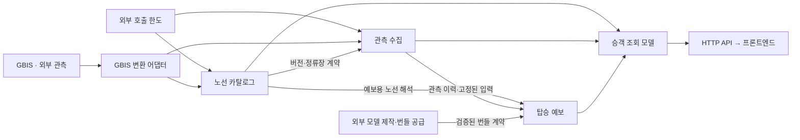
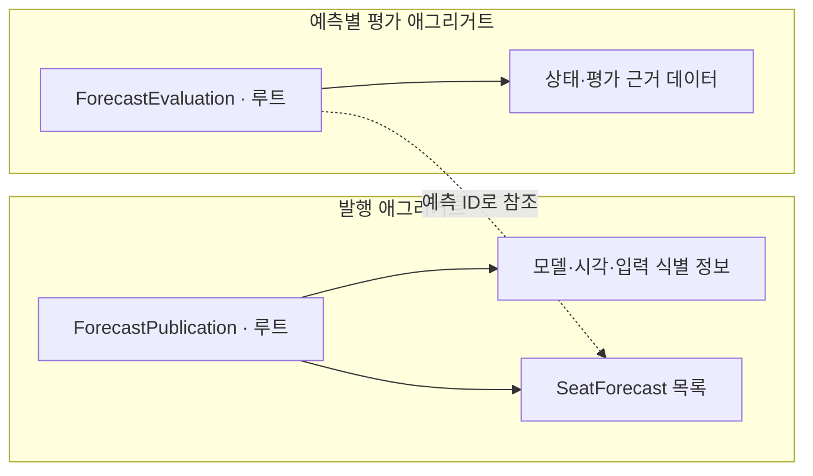
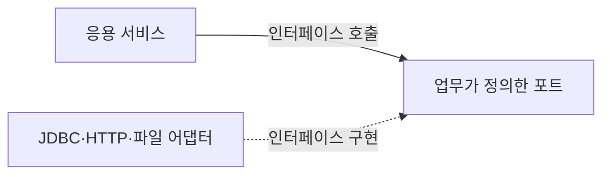
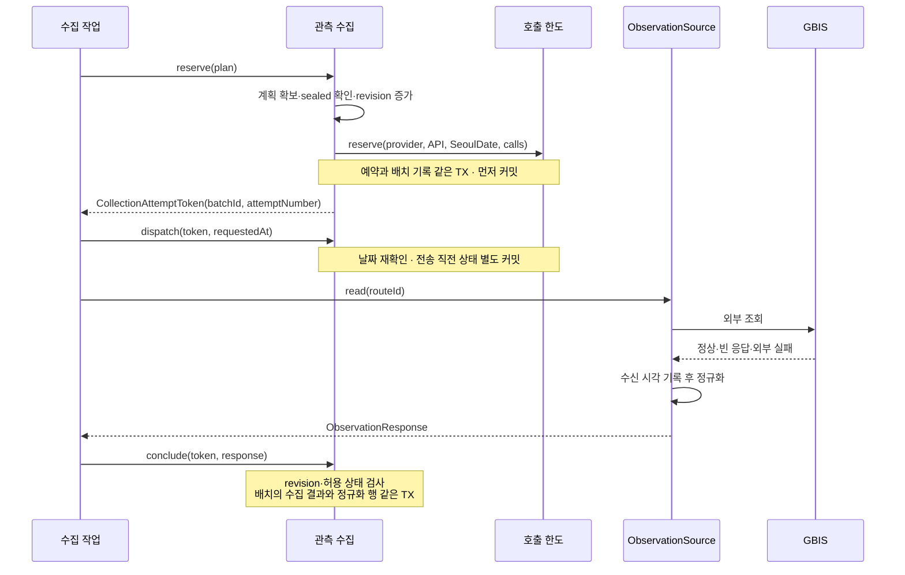

# SAL-134 백엔드 DDD 재설계 제안

기준 코드는 `9f9c75d`이며 2026-09-23에 [코로구의 PR #70(SAL-133)](https://github.com/woowacourse-teams/2026-salmonbus/pull/70)까지 반영해 검토했다. 최초 작성일은 2026-09-22다. 이 문서는 승인된 설계와 현재 소스의 구현을 함께 설명한다. 재설계 전 동작은 기준 커밋으로 구분하고, 전체 검증 결과와 운영 반영 여부는 진행 기록에서 관리한다. PR #70에서 이미 구현한 동작과 이번에 바꾼 구조를 구분해 설명한다.

구현이 승인된 범위는 백엔드 전면 재설계와 완료된 S3 이관 코드 제거다. 현재 [용어집](glossary.md)을 이름의 기준으로 사용하고, 실제 구현·검증 상태는 [진행 기록](implementation-progress.md)에서 관리한다. 운영 데이터 전환은 쓰기를 중지한 정비 시간에 일괄 수행한다. 구·신 앱의 혼합 운영과 이중 쓰기는 적용하지 않는다. 실제 예보 입력의 별도 스냅샷 저장과 프론트엔드 수정은 이번 범위에서 제외한다.

이 문서는 DDD의 기초부터 설명하고 그 개념으로 우리 프로젝트의 구조를 정한다. 먼저 업무를 모델로 표현한다는 뜻을 살펴본다. 이후 하나의 수집 배치가 수집·예보·평가되는 과정을 따라가며 객체의 책임, 저장 단위, 조회 방식을 정한다. 각 선택의 근거는 현재 코드의 동작과 유지해야 할 규칙이다.

이번 설계는 **백엔드의 업무 모델, 객체의 책임, 모듈과 의존 관계, DB 구조, 트랜잭션과 처리 흐름 전체를 재검토하는 전면 재설계**다. 먼저 우리 서비스에 필요한 규칙과 목표 구조를 정하고, 그다음 기존 코드와 데이터를 어떻게 옮길지 정한다. 현재 구현은 업무를 이해하고 필요한 동작을 확인하는 근거로 삼는다. 기존 구조의 유지·수정·교체 여부는 목표 설계에 맞는지를 기준으로 판단한다.

제안하는 구조는 **노선 카탈로그·관측 수집·탑승 예보의 세 업무 영역**이다. API와 Worker는 현재처럼 따로 실행하고 PostgreSQL도 함께 사용한다. 아래에서 이 구분이 나온 이유와 구체적인 구현 구조를 설명한다. DDD 개념의 정의와 이번 프로젝트에서 선택한 구현 방식은 구분해서 읽어야 한다.

- 0절: DDD와 도메인 모델, 상태·행동·책임의 뜻을 설명한다.
- 1~4절: 업무와 용어를 정하고 업무 영역을 나눈다.
- 5~8절: 객체가 어떤 규칙을 책임지고 어떻게 저장되는지 정한다.
- 9~10절: 조회와 이벤트의 적용 범위를 정한다.
- 11~14절: 모듈 구성, 처리 흐름, 데이터 구조와 작성 원칙을 제시한다.
- 15~16절: 기존 D안과의 차이, 팀에서 합의할 정책을 정리한다.

실제 코드와 유지할 동작은 [근거와 보존 계약](01-evidence.md), 구현·스키마 변경·배포 순서는 [전환 계획](02-migration-plan.md)에 있다. 기존 Java 파일 330개를 어디에 배치할지는 [전체 클래스 배치표](03-class-map.md)에 정리했다. 본문의 구현 이름은 현재 소스에 맞췄다. 초기 이동·삭제 계획은 클래스 배치표에 보존하고, 같은 문서의 현재 구현 절에서 실제 모듈과 주요 연결을 확인할 수 있다.

## 0. DDD를 이해하기 위한 기초

### 0.1 DDD가 설계의 기준으로 삼는 것

DDD는 Domain-Driven Design, 도메인 주도 설계의 약자다. 업무를 이해하고 그 업무에서 쓰는 말과 규칙을 코드 구조에 반영하는 설계 방식이다.

여기서 ‘주도’는 업무의 의미와 규칙을 설계 판단의 기준으로 삼는다는 뜻이다. ‘설계’에는 객체의 이름과 책임, 객체 사이의 협력, 데이터를 변경하고 저장하는 방법이 포함된다.

우리 프로젝트에서 업무는 버스 잔여석을 관측하고 정류장별 탑승 가능성을 예보하는 일이다. 이 업무를 이해하려면 값을 어디에 저장할지와 함께, 그 값이 무슨 뜻이고 어떤 상황에서 바뀔 수 있는지도 알아야 한다.

예를 들어 잔여석에 0을 저장했다면 다음 두 경우를 구분해야 한다.

- 외부 API가 잔여석 0석이라고 응답했다.
- 외부 API의 잔여석을 해석하지 못해 임의로 0을 넣었다.

화면에 보이는 숫자는 같아도 첫 번째는 만석 관측이고 두 번째는 정보 부재다. 이 차이를 놓치면 만석 확률을 계산하는 입력부터 잘못된다. DDD에서는 이런 의미를 먼저 정하고 `RemainingSeats`처럼 구분을 표현할 수 있는 값과 규칙을 설계한다.

그래서 설계 과정은 업무 질문에서 시작한다. 무엇을 기록해야 하는지, 어떤 변경을 허용할지, 실패하면 무엇이 남아야 하는지 확인한다. 그 답을 객체의 이름·데이터·메서드·저장 규칙으로 옮긴다. 업무에 대한 이해가 바뀌면 모델과 코드도 함께 수정한다. [Martin Fowler, Ubiquitous Language](https://martinfowler.com/bliki/UbiquitousLanguage.html)

### 0.2 모델과 도메인 모델

여기서 모델은 **업무를 설명하고 처리하는 데 필요한 부분을 골라 표현한 것**이다. 버스의 모든 정보를 코드에 넣는 것이 아니라, 서비스가 판단하는 데 필요한 노선·정류장 순서·관측 시각·잔여석 등을 선택한다.

도메인 모델에는 데이터와 그 데이터에 적용할 행동·규칙이 함께 들어간다. 클래스의 필드 목록만 정하는 작업보다 범위가 넓다. [Martin Fowler, Domain Model](https://martinfowler.com/eaaCatalog/domainModel.html)

예를 들어 목표 설계의 `CollectionBatch`를 설명하려면 다음 정보가 필요하다.

| 살펴볼 내용 | 수집 배치에 적용 |
| --- | --- |
| 어떤 대상인가 | 한 수집 계획의 현재 시도와 그 결과 |
| 무엇을 기억하는가 | 배치 ID, 시도 번호, 처리 상태, 관측 행, 사용 확정 여부 |
| 어떤 일을 할 수 있는가 | 새 시도 시작, 전송 기록, 결과 저장, 사용 확정 |
| 어떤 변경을 거절하는가 | 예보에 사용이 확정된 배치의 재열기, 지난 시도의 응답으로 현재 결과 변경 |

이 대상과 정보, 행동, 규칙을 함께 설명한 것이 수집 배치의 도메인 모델이다.

우리 프로젝트에서는 ‘모델’이라는 말을 예측 모델에도 사용하므로 뜻을 구분한다.

| 표현 | 뜻 | 예 |
| --- | --- | --- |
| 도메인 모델 | 업무의 대상·값·행동·규칙을 코드로 표현한 것 | 수집 배치의 상태와 재시도 규칙, 예보 발행과 평가 |
| 예측 모델 | 입력으로부터 좌석 확률 등을 계산하는 모델 | 적재한 번들의 계수와 예측 계산 |
| DB 구조 | 값을 저장하는 테이블·컬럼·키의 구조 | observation_batch, seat_forecast |

예측 모델의 실행과 관리도 도메인 모델이 다루는 업무에 포함된다. 도메인 객체와 DB 테이블은 연결되지만, 객체 하나와 테이블 하나를 항상 같은 단위로 정할 필요는 없다.

### 0.3 상태·행동·책임을 코드로 표현한다는 뜻

클래스는 객체가 어떤 정보를 가지고 어떤 메서드를 제공할지 정의한다. 실행 중에 만들어진 객체는 특정 노선이나 수집 배치의 현재 정보를 가진다.

- **상태**는 객체가 현재 기억하는 값이다. 수집 배치에서는 시도 번호와 처리 상태 등이 해당한다.
- **행동**은 업무에서 수행하는 일이다. 새 시도를 시작하거나 결과를 확정하는 일이 해당한다.
- **책임**은 그 객체가 판단하고 지켜야 하는 범위다. 수집 배치라면 현재 상태에서 재열기가 가능한지 검사하는 책임을 갖는다.

문서에서 말하는 **일관성**은 상태와 데이터가 업무 규칙에 맞고 서로 모순되지 않는다는 뜻이다. 예를 들어 현재 시도 번호는 바뀌었는데 이전 시도의 관측이 그대로 남아 있으면, 어떤 호출의 결과를 저장한 것인지 맞지 않게 된다.

“예보에 사용한 수집 배치는 다시 열어 관측을 교체할 수 없다”라는 업무 문장을 코드 책임으로 바꾸면 다음과 같다.

1. 대상을 `CollectionBatch`로 표현한다.
2. 사용이 확정됐는지 기억할 상태를 둔다.
3. 새 시도를 시작하는 행동이 그 상태를 검사한다.
4. 사용이 확정됐다면 변경을 거절한다.
5. 허용된 변경은 저장소에서 저장한다.

새 시도를 시작하는 호출자가 조건을 매번 따로 검사한다면, 나중에 다른 호출 경로를 추가하면서 검사를 빠뜨릴 수 있다. 객체가 상태 변경을 수행할 때 직접 검사하도록 하면 호출 경로가 달라도 같은 규칙을 적용할 수 있다. 이렇게 내부 상태를 변경하는 방법을 제한하는 것을 **캡슐화**라고 한다.

현재 코드에도 값 검증과 상태 변경 메서드가 있다. 이번 설계는 이런 규칙을 유지하면서 책임을 명확히 하고 빠진 조건을 보완하는 작업이다. 모든 규칙이 지금까지 서비스의 조건문으로만 작성됐다고 전제하지 않는다.

객체의 검사와 DB의 동시성 제어는 역할이 다르다. 두 작업이 같은 배치를 동시에 읽으면 각자 가진 객체에서는 변경이 가능한 것으로 보일 수 있다. 그때 충돌을 막는 잠금과 조건부 갱신은 뒤의 저장·트랜잭션 설계에서 다룬다.

### 0.4 업무를 나누는 설계와 객체를 만드는 설계

DDD 개념은 다루는 범위에 따라 구분하면 이해하기 쉽다.

| 구분 | 정하는 내용 | 이 문서에서 다룰 예 |
| --- | --- | --- |
| 전략적 설계 | 업무를 어디에서 나누고 서로 어떤 정보로 연결할지 | 노선 카탈로그·관측 수집·탑승 예보, 업무별 용어와 공개 기능 |
| 전술적 설계 | 각 업무 안에서 값을 표현하고 규칙을 지킬 객체를 어떻게 만들지 | 엔티티, 값 객체, 애그리거트, 도메인 서비스, 리포지토리 |

두 설계는 연결된다. 관측 수집을 별도 업무로 나눴다면 수집 배치의 상태와 재시도를 그 안에서 책임져야 한다. 예보가 수집의 내부 상태를 임의로 바꾸는 구조라면 경계와 객체 책임을 함께 검토해야 한다.

이후 절에서는 같은 예시를 이어서 사용한다. 한 수집 계획을 관리하는 배치를 **수집 배치 A**라고 부르고, 예시에서는 현재 시도가 정상 응답을 받은 상황을 따른다. A의 관측으로 예보를 발행한 뒤 후속 관측으로 실제 결과를 평가하는 과정을 살펴본다. A는 설명을 위한 이름이다. 같은 수집 계획을 재시도할 수 있는 현재 동작과 이를 구분하는 시도 번호도 설계에 유지한다.

## 1. 도메인과 하위 도메인: 어떤 업무를 설계할 것인가

### 1.1 도메인

**도메인(Domain)은 소프트웨어가 다루는 업무나 문제 영역이다.** 우리 서비스에서는 광역버스의 잔여석을 관측하고 정류장별 탑승 가능성을 예보하는 일이 해당한다. 사용자는 다가오는 버스에 탈 자리가 있을지 판단하려고 서비스를 이용한다.

‘업무’는 회사 내부의 행정 처리만 뜻하지 않는다. 이 서비스가 사용자를 위해 알아야 하고 판단해야 하는 내용을 포함한다. 노선과 정류장의 관계, 관측이 얼마나 오래됐는지, 잔여석을 알 수 있는지, 예보가 무엇을 의미하는지가 모두 설계 대상이다.

이 서비스는 외부에서 관측한 버스 위치와 잔여석을 기록하고 정류장별 접근 차량의 탑승 가능성을 계산해 보여준다. 좌석 예약이나 탑승 보장은 제공하지 않는다.

1. 노선을 등록하고 정류장 순서·방향·시간표를 확보한다.
2. API 호출 횟수를 예약하고, 호출 전후의 상태를 남긴다.
3. GBIS 응답을 우리 관측값으로 바꾼다. 잔여석 0과 모르는 값을 구분한다.
4. 관측 이력, 과거 통계, 실제 적재된 모델, 당일 결과를 사용해 예보를 낸다.
5. 후속 관측으로 예보 대상 정류장을 지난 결과를 판정하고, 당일 보정과 통계에 반영한다.
6. 사용자는 노선 목록, 예보 보드, 실시간 차량을 조회한다.

PR #70으로 문제 차량의 편도를 조사하고 해당 자료를 예보·보정·통계에서 제외하는 업무가 추가됐다. 예를 들어 82석이라는 응답은 원 관측에 남기지만 현재 모델이 지원하는 70석 상한을 넘으므로 계산에 그대로 넣지 않는다. 문제 차량의 예보를 보류하는 동안에도 다른 차량의 예보는 계속 만든다. 70석은 현재 계산의 지원 범위이며 실제 차량 정원을 확정한 값은 아니다.

예를 들어 새 수집 B가 실패했더라도 이전 정상 예보 A가 5분 이내라면 보드에는 A가 나올 수 있다. 실시간 차량은 B의 실패를 반영해 `UNKNOWN`을 반환한다. 두 화면에서 최신 데이터를 고르는 기준이 다르므로 이 차이를 설계에서도 유지한다.

이 흐름에서 먼저 정해야 할 것은 데이터의 의미다. 잔여석을 모르는 경우를 0석으로 기록하면 만석 여부를 잘못 판단한다. 수집에 실패한 사실을 정상적인 빈 응답으로 바꾸면 차량이 없다는 잘못된 정보를 전달한다. 이런 규칙이 객체와 처리 흐름을 설계하는 기준이 된다.

### 1.2 하위 도메인과 핵심 업무

**하위 도메인(Subdomain)은 전체 문제를 해결하는 데 필요한 개별 업무다.** 우리 서비스의 일을 나누고, 그중 제품의 가치를 직접 만드는 업무와 이를 지원하는 업무를 구분한다.

수집 배치 A로 예보를 내려면 먼저 A가 어느 노선 버전에 속하는지 알아야 한다. 관측값이 제대로 해석됐는지도 확인해야 하고, 이후에야 예측 계산을 할 수 있다. 이 과정에서 노선 정의를 관리하는 일, 관측 사실을 확보하는 일, 예측과 평가를 수행하는 일은 서로 다른 규칙을 가진다. 이 규칙들을 구분한 결과가 아래의 업무 분류다.

| 필요한 업무 | 이번 안에서의 분류 | 설계에 반영할 내용 |
| --- | --- | --- |
| 탑승 가능성 계산, 실제 결과 평가, 보정과 통계 | 핵심 하위 도메인(Core Subdomain) 후보 | 예측의 의미와 계산 규칙을 명시하고 재현성·평가 일관성에 설계 시간을 우선 배분 |
| 노선·정류장·시간표 관리 | 지원 하위 도메인(Supporting Subdomain) 후보 | 예보와 수집이 같은 노선 버전을 사용할 수 있도록 변경 책임과 조회 규칙 정리 |
| 관측 수집·정규화·재시도 관리 | 지원 하위 도메인 후보 | 실패와 정보 부재를 구분하고 실제로 수집한 사실을 보존 |
| 외부 API 호출 한도 관리 | 두 업무에서 쓰는 지원 기능 | 노선과 위치 수집의 사용 횟수를 같은 규칙으로 관리 |

핵심과 지원은 중요도나 구현 난이도의 순위가 아니다. 관측 수집도 복잡하고 실패하면 서비스가 동작하지 않지만, 이번 분류에서는 신뢰할 수 있는 자료를 확보해 예보를 지원하는 역할로 본다.

일반 하위 도메인(Generic Subdomain)은 여러 서비스에서 공통적으로 필요한 업무를 가리킨다. 현재 조사 범위에서는 별도 업무 영역으로 선정하지 않았다. Clock, Flyway, HTTP 클라이언트 같은 기술 요소를 이 분류에 넣지는 않는다. 핵심 업무에 설계를 집중한다는 기준은 [Eric Evans의 DDD Reference](https://www.domainlanguage.com/wp-content/uploads/2016/05/DDD_Reference_2015-03.pdf)의 Core Domain과 Generic Subdomains를 참고했다.

여기서 업무를 나눈 결과가 곧바로 모듈 목록이 되는 것은 아니다. 다음 절에서 용어와 모델을 살펴본 뒤 코드에서 지킬 경계를 정한다.

## 2. 유비쿼터스 언어: 같은 말이 같은 동작을 뜻하게 한다

**유비쿼터스 언어(Ubiquitous Language)는 업무를 설명할 때 쓰는 말을 대화·문서·코드·테스트에서 같은 뜻으로 사용하는 것이다.** [DDD Reference의 Ubiquitous Language](https://www.domainlanguage.com/wp-content/uploads/2016/05/DDD_Reference_2015-03.pdf)

우리 코드에서는 ‘성공’, ‘완료’, ‘최신’만으로 상태를 설명하면 의미가 모호해진다. 수집 성공은 예보 발행 완료와 다르고, 외부 API의 응답에 차량이 있었다는 사실과 저장할 수 있는 차량이 있다는 사실도 다르다.

배치 A를 처리하는 동안 “완료됐다”는 말이 가리킬 수 있는 순간을 나눠 보면 차이가 보인다.

| 순간 | 확인한 사실 | 아직 의미하지 않는 것 |
| --- | --- | --- |
| 외부 API가 정상 응답 | 요청에 대한 정상 응답을 받음 | 모든 행을 저장했거나 예보를 발행했다는 뜻은 아님 |
| 관측 저장 완료 | 이번 시도의 수집 결과와 저장 가능한 관측을 기록함 | 예보 계산이 끝났다는 뜻은 아님 |
| 예보 발행 완료 | 이번 배치의 예측을 모두 저장하고 완료를 기록함 | 실제로 그 좌석 상태가 관측됐다는 뜻은 아님 |
| 실제 결과 평가 완료 | 나중의 관측으로 예측의 실제 결과를 확정함 | 과거에 발행한 예측값을 바꾼다는 뜻은 아님 |
| 편도 품질 조사 완료 | 조사 대상 편도의 사용 여부를 판정하고 조사 보류를 해제할 조건을 확인함 | 원 관측값이나 과거 예측값을 고쳐 썼다는 뜻은 아님 |

팀에서 이 단계를 모두 ‘처리 완료’라고 부르면 메서드와 테스트가 어느 완료를 다루는지 알기 어렵다. 그래서 수집 완료·발행 완료·평가 완료를 나누어 말하고, 코드에서도 각각 다른 행동과 상태로 표현한다. 뜻이 맞지 않는 이름을 발견하면 문서와 코드의 표현을 함께 검토한다.

예를 들어 외부 API가 차량을 반환했는데 모든 행이 검증에서 제외됐다면 `SUCCESS_ROWS`라는 수집 결과를 차량 없음으로 바꾸지 않는다. 잔여석도 실제 0석과 알 수 없는 값을 구분한다. 이 구분은 클래스 이름뿐 아니라 조건문과 테스트 기대값에도 이어져야 한다.

이번 설계에서는 아래 용어를 사용한다.

| 업무 용어 | 제안 코드 이름 | 의미 |
| --- | --- | --- |
| 노선 | `Route` | 외부 노선 식별자와 서비스 노선의 관계, 현재 버전 교체를 책임지는 객체 |
| 노선 버전 | `RouteVersion` | 그 버전에서의 정류장 순서와 경로. 시간표 수정 정책은 별도로 명시 |
| 노선 내 정류장 위치 | `RouteStop` | `routeVersionId + stopOrder`. 같은 정류장 ID가 왕복 경로에 여러 번 나올 수 있음 |
| 수집 계획 | `CollectionPlan` | `routeVersionId + attemptKey`. 실제 HTTP 호출 한 번과 다름 |
| 현재 수집 시도 | `CollectionAttemptToken` | `batchId + attemptNumber`. 늦게 도착한 이전 응답을 구분하는 식별자 |
| 수집 배치 | `CollectionBatch` | 같은 계획의 현재 시도와 관측 행, 실패·정상 빈 응답을 함께 관리 |
| 입력 확정 | `inputConfirmedAt`, `confirmInput` | 예보 입력으로 확정한 수집 배치의 재열기·원 관측 교체를 막는 상태와 행동. 이후 품질 사용 조건의 변경과 구분 |
| 예보 발행 | `ForecastPublication` | 수집 배치 하나에 대한 예측 결과 전체와 계산 근거를 원자적으로 공개한 사실 |
| 예측 한 줄 | `SeatForecast` | 특정 관측 차량과 대상 정류장의 확률·기대 잔여석 |
| 예보 평가 | `ForecastEvaluation` | 발행한 예측의 평가 대기와 결과 확정을 관리 |
| 평가 결과 | `EvaluationResult` | 좌석 확인·좌석 정보 없음·건너뜀·추적 중단 등을 구분하는 값 |
| 통계 버전 | `DemandStatisticsVersion` | 동일 자료 기준으로 계산해 함께 공개한 셀 통계 묶음 |
| 당일 보정 | `SameDayFullOutcomeCount`, `SameDayFullOutcomes` | 노선·서울 날짜·예보 거리별 새 평가 결과의 누계 |
| 모델 식별 정보 | `ModelIdentity` | 릴리스 ID, 번들 digest, 특징 계산 계약 등 실제 계산을 구분하는 값 |
| 편도 | 편도 판정과 관측 연결 | 기점·회차지 출발이나 방향 전환으로 구분한 한 방향의 운행. 관측 간격만으로 확정하지 않음 |
| 편도 품질 판정 | `OneWayTripAssessment` | 조사한 편도를 사용 가능·경계 미확정·제외로 판단한 기록 |
| 품질 조사 | `TripQualityInvestigation` | 이상 차량의 편도 시작을 찾고 이후 관측을 다시 판정하는, 재개 가능한 작업 |
| 품질 버전 | `RouteDataQuality.revision` | 노선의 자료 사용 조건이 바뀌었음을 구분하는 값. 수집 시도 번호·통계 세대 번호와 별개 |
| 예보 제공 상태 | `ForecastResponse.Status` | 화면에서 예보를 제공할 수 있는지 나타내는 AVAILABLE/UNAVAILABLE. 확률 0과 구분 |

`ArrivalLabel`은 대상 정류장을 통과하거나 출발한 뒤의 관측으로 실제 결과를 판정한다. 단순히 정류장에 접근했다는 뜻으로 사용하지 않는다. 기존 이름을 바꾸는 경우에도 이 의미를 먼저 팀에서 맞춘다.

‘최신’도 조회 목적에 따라 구체적으로 부른다. 보드에서는 **최신 발행 완료 예보**, 차량 화면에서는 **최신 수집 시도**를 사용한다. 이 차이가 이후 읽기 모델을 나누는 근거다.

## 3. 경계 컨텍스트: 어디까지 같은 모델을 사용할 것인가

**경계 컨텍스트(Bounded Context)는 같은 용어와 모델을 일관되게 사용할 수 있는 범위다.** 같은 현실의 대상을 서로 다른 업무에서 다르게 표현할 수도 있다. [Martin Fowler, Bounded Context](https://martinfowler.com/bliki/BoundedContext.html)

우리 프로젝트의 ‘노선’을 보면 차이가 드러난다.

| 노선을 사용하는 곳 | 필요한 의미와 규칙 |
| --- | --- |
| 노선 카탈로그 | 현재 버전은 무엇인지, 정류장 순서와 시간표를 언제 바꿀 수 있는지 |
| 관측 수집 | 이번 호출과 관측이 어느 노선 버전에 속하는지 |
| 탑승 예보 | 관측 차량에서 목표 정류장까지 몇 정류장 남았고 승차가 가능한지 |
| 승객 API | 사용자에게 보여줄 노선 이름·방향·상태가 무엇인지 |

모든 곳에서 하나의 큰 Route 클래스를 공유하면 조회에 필요한 필드와 버전 변경 규칙, 예측용 계산이 함께 영향을 받는다. 따라서 카탈로그가 노선 정의와 변경을 책임지고, 수집과 예보는 공개된 정보를 받아 자기 업무에 필요한 모델로 바꾼다. 같은 이름의 `RouteStops`가 있다는 이유만으로 통합하지 않는다.

구체적으로 카탈로그는 정류장 순서가 바뀌었을 때 기존 노선 버전을 종료하고 새 버전을 만들지 판단한다. 예보는 그 순서를 읽어 관측 차량 앞의 정류장을 고르면 된다. 예보 코드에 노선 버전을 변경하는 기능까지 전달할 필요는 없다. 버전 ID와 필요한 정류장 정보만 받아 예보용 모델을 구성한다.

여기서 모델이 같다는 말은 클래스 이름이나 필드 구성이 같다는 뜻만은 아니다. 어떤 값이 유효하고 누가 변경할 수 있는지도 포함한다. 따라서 경계 컨텍스트를 나눌 때는 필요한 정보뿐 아니라 변경 책임과 규칙도 함께 살펴본다.

이 기준으로 다음 세 경계 컨텍스트를 제안한다.

| 업무 영역 | 주요 질문 | 관리 대상 | 다른 영역에 제공하는 기능 |
| --- | --- | --- | --- |
| 노선 카탈로그 `route-catalog` | 이 노선의 현재 경로·정류장 순서·시간표는 무엇인가 | 노선 식별, 버전 교체, 정류장·승차 정책, 시간표 | 특정 버전의 조회 결과, 현재 버전 식별자 |
| 관측 수집 `observations` | 언제 무엇을 호출했고 어느 시도에서 어떤 값을 받았는가 | 수집 계획, 시도 번호, 전송 상태, 정규화, 원 관측값, 사용 확정 | 최신 시도, 관측 저장 사실과 이력, 고정된 원 입력 |
| 탑승 예보 `forecasting` | 어떤 관측을 계산에 사용할 수 있고, 앞으로 탈 확률과 실제 결과는 무엇인가 | 편도 품질 조사·판정, 예보 발행, 실제 결과 판정, 통계 세대, 당일 보정, 모델 활성화 | 용도별 사용 가능한 자료, 예보 제공 상태, 모델 정보, 통계 계산 계약 |

예보 안의 평가·통계·당일 보정·모델 관리는 우선 하나의 컨텍스트에 둔다. 같은 예측의 식별 정보와 시간 기준을 공유하고 평가 확정과 보정 누계를 함께 커밋해야 하기 때문이다. 내부 패키지로 책임을 나누되 각각을 독립된 컨텍스트나 서버로 분리하지 않는다.

편도 품질도 예보 영역 안의 `quality`에 둔다. 현재 품질 규칙은 모델의 좌석 지원 범위와 연결되고, 판정 결과가 예보 제공·정원 추정·평가·보정·통계에 함께 영향을 주기 때문이다. 관측 영역은 수집한 값을 보존하고 예보 영역은 그 값을 사용할 조건을 판단한다. 이 책임을 구분하기 위해 별도의 서버나 네 번째 컨텍스트를 추가할 필요는 없다.

API는 이 세 업무의 조회 결과를 화면에 맞게 조합하는 역할로 둔다. Worker는 업무를 정해진 시점에 실행한다. 현재 코드에서 확인한 역할을 기준으로 한 선택이며, API가 별도 프로세스라는 이유만으로 별도 업무 컨텍스트가 되지는 않는다.

| 구분 | 정하는 대상 | 이번 설계 |
| --- | --- | --- |
| 하위 도메인 | 해결해야 할 업무 문제 | 예보, 노선 관리, 수집 등의 업무 |
| 경계 컨텍스트 | 하나의 모델과 용어를 적용할 범위 | 노선 카탈로그·관측 수집·탑승 예보 |
| Gradle 모듈 | 코드 의존성과 빌드 단위 | 업무·연동·앱을 포함한 9개 모듈 |
| 실행 앱 | 실행과 배포 단위 | API와 Worker, 별도로 실행하는 운영 정비 CLI |

업무 경계 3개와 모듈 9개, 상시 실행 앱 2개는 서로 다른 대상을 나눈 결과다. 운영 정비 CLI는 이 두 앱과 별도로 필요할 때 실행한다. 호출 한도는 `api-call-quota` 지원 모듈로 제공하며 현재는 별도 업무 컨텍스트로 확정하지 않는다.

이 구분은 코드에서 확인한 책임과 일관성 요구를 바탕으로 만든 검토안이다. 팀에서 사용하는 업무 용어와 운영 계획에도 맞는지 검토할 필요가 있다.

## 4. 컨텍스트 맵과 변환 계층: 다른 업무의 데이터를 어떻게 받을 것인가

**컨텍스트 맵(Context Map)은 업무 영역 사이에 어떤 정보를 주고받으며 누가 그 의미를 책임지는지 나타낸다.** 아래 화살표는 정보를 제공하는 방향이다. 코드를 참조하는 방향은 정보를 사용하는 쪽에서 제공자의 공개 인터페이스를 향한다.



노선 카탈로그는 관측 수집과 별개로 노선을 정의하고 관리한다. 관측 수집 역시 예보의 성공 여부와 관계없이 수집 사실을 보존한다. 예보는 두 영역의 공개 계약을 받아 자신의 계산 모델로 변환하며 JPA 엔티티를 공유하지 않는다.

실제 결과 판정·당일 보정·통계·모델 관리는 우선 예보 영역 내부에 둔다. 같은 예측 식별 정보와 시간 기준을 사용하고, 결과 확정과 보정 누계는 함께 커밋되어야 하기 때문이다.

모델 학습 리포지토리는 번들을 공급하는 외부 시스템으로 취급한다. 조사 범위는 현재 저장소가 번들을 받아 사용하는 계약까지이며 외부 학습 파이프라인 전체는 검증하지 않았다.

### 4.1 외부 모델을 그대로 전달하지 않는 이유

**부패 방지 계층(Anti-Corruption Layer, ACL)은 외부 시스템의 모델을 우리 업무의 의미로 변환하는 부분이다.** [DDD Reference의 Anticorruption Layer](https://www.domainlanguage.com/wp-content/uploads/2016/05/DDD_Reference_2015-03.pdf)

GBIS의 JSON을 Java 객체로 읽는 것만으로 관측값의 의미가 정해지지는 않는다. 외부 응답의 좌석값을 보고 실제 잔여석인지, 알 수 없는 값인지 판단해야 한다. 차량이 없는 정상 응답과 행을 해석하지 못한 응답도 구분해야 한다.

JSON 변환은 응답의 형식을 읽는 일이다. 변환 계층은 읽은 값이 우리 업무에서 무엇을 뜻하는지 정한다. 예를 들어 좌석값을 해석할 수 없으면 정상적인 0석으로 대체하지 않고 알 수 없는 좌석값으로 변환한다. 이후 예측 계산은 GBIS 응답 형식을 다시 확인하는 대신 이 도메인값의 의미를 사용한다.

`gbis-client`는 HTTP·인증·JSON·외부 오류를 다룬다. 관측 응용 서비스는 도메인 포트인 `ObservationSource`를 호출하고 `ObservationResponse`를 받는다. infrastructure의 `GbisObservationSource`와 `GbisObservationMapper`가 GBIS 조회·변환을 담당하므로 응용·도메인 계층에서 GBIS 타입을 사용하지 않는다. 카탈로그도 자신의 변환 어댑터에서 노선 정보를 해석한다.

### 4.2 내부 영역도 공개된 정보로 연결한다

여기서 **공개 계약**은 다른 코드가 기능을 사용할 때 기대할 수 있는 입력·결과·오류·처리 규칙을 뜻한다. Java 인터페이스의 메서드 형태뿐 아니라 어떤 데이터를 돌려주는지까지 포함한다. 예를 들어 ‘최신 관측 조회’라는 이름만으로는 실패한 최신 시도를 반환하는지, 마지막 정상 결과를 반환하는지 알 수 없으므로 그 기준도 정해야 한다.

카탈로그의 `CurrentRouteVersion`은 수집에 사용할 버전을 제공한다. 예보의 입력 잠금·확정은 관측의 `CollectionInputs`를 호출한다. 노선·관측 이력 조회는 예보 영역의 JDBC 어댑터가 같은 DB의 테이블과 품질 view를 읽어 계산용 모델로 바꾼다. 다른 영역의 JPA 엔티티를 공유하지 않지만 SQL 조회는 스키마 계약에 의존한다.

API는 같은 PostgreSQL의 공개 조회 규칙을 사용한다. 조회에 필요한 열과 필터의 의미를 담당 업무 영역이 관리하고, 필요하면 버전이 있는 SQL view로 제공한다. 같은 DB를 사용하는 만큼 스키마 변경의 영향은 남으며 이관·호환성 검사로 관리한다.

모든 기술 설정을 공유 도메인 모델로 만들지는 않는다. `common`은 Clock·Flyway·테스트 기반을 두는 기술 모듈로 유지한다.

PR #70에서 common에 있던 `VehicleObservationsStored`는 `observations.api`로 옮겼다. `ObservationLoader`가 저장 전에 `CollectionQualityHook`을 호출해 품질 잠금을 확보하고, 저장소가 새 결과인 `StoredObservations`를 반환했을 때만 저장 후 훅으로 조사를 등록한다. 같은 결과를 다시 전달한 경우에는 조사를 중복 등록하지 않는다. forecasting의 `CollectionQualityAdapter`가 포트를 구현하며 JPA 저장 어댑터는 다른 업무의 공개 기능을 실행하지 않는다.

## 5. 엔티티와 값 객체: 같은 대상을 어떻게 구분할 것인가

### 5.1 엔티티

**엔티티(Entity)는 속성이 달라져도 식별자를 기준으로 같은 대상으로 추적하는 객체다.** [DDD Reference의 Entities](https://www.domainlanguage.com/wp-content/uploads/2016/05/DDD_Reference_2015-03.pdf)

노선의 시간표가 바뀌어도 같은 노선으로 관리한다. 수집 배치도 예약·전송·완료로 상태가 바뀌지만 같은 배치 ID로 추적한다. 따라서 목표 설계의 `Route`, `CollectionBatch`, `ForecastPublication`, `ForecastEvaluation`은 식별자를 가진 엔티티로 다룬다.

배치 A를 예약했을 때와 응답을 저장했을 때의 필드 값은 다르다. 그래도 같은 배치 ID를 사용하므로 A의 상태가 바뀐 것으로 본다. 반대로 다른 배치 B가 우연히 같은 차량과 잔여석을 기록했더라도 ID가 다르면 별개의 수집이다.

DB에서 A를 두 번 읽으면 메모리에는 서로 다른 Java 객체가 만들어질 수 있다. 그래도 업무상 추적하는 대상은 같은 A다. 엔티티의 식별자는 이런 구분을 위한 것이며, Java 객체의 메모리 주소와는 다르다.

발행 후 값을 바꾸지 않는 `ForecastPublication`도 특정 발행을 식별자로 추적하므로 엔티티다. 불변 객체라는 이유만으로 값 객체가 되는 것은 아니다.

### 5.2 값 객체

**값 객체(Value Object)는 구성한 값이 같으면 같은 의미로 취급하는 객체다.** 이 설계에서는 생성 후 값을 바꾸지 않고 필요한 경우 새 값으로 교체한다. [Martin Fowler, Value Object](https://martinfowler.com/bliki/ValueObject.html)

서로 따로 만든 두 잔여석 값이 모두 ‘알려진 0석’이라면 같은 좌석값으로 취급한다. 어느 배치에서 읽었는지는 그 값을 포함한 관측이 관리한다. 반면 ‘알 수 없는 좌석’은 0석과 다르다.

따라서 엔티티를 비교할 때는 같은 대상을 가리키는지를 보고, 값 객체를 비교할 때는 같은 의미의 값을 담았는지를 본다. 값 객체를 바꿀 때 새 값을 만드는 이유는 여러 객체가 공유한 값이 한쪽의 수정으로 함께 바뀌는 일을 피하기 위해서다.

| 값 객체 | 담는 의미 | 필요한 이유 |
| --- | --- | --- |
| `RemainingSeats` | 알려진 잔여석 또는 알 수 없는 이유 | 실제 0석과 정보 부재를 구분 |
| `RouteStop` | 노선 버전과 그 안의 정류장 순번 | 왕복 경로에서 같은 정류장 ID가 반복되는 경우 구분 |
| `CollectionAttemptToken` | 배치 ID와 현재 시도 번호 | 이전 시도의 늦은 응답을 식별 |
| `ModelIdentity` | 릴리스 ID·digest·특징 계산 계약 | 실제 계산에 사용한 모델을 구분 |
| `ForecastDistance` | 예측 대상까지의 정류장 거리 | 계산에 사용하는 거리의 의미와 허용 범위를 관리 |
| `OneWayTripClassifier.Route` | 노선 버전별 관측 연결 간격과 판정 규칙 버전 | 기본 10분 정책과 설정 근거를 명시하고 조사 재개 시 같은 기준 유지 |

원 관측의 `RemainingSeats`와 모델 입력의 좌석 범위는 구분한다. 외부에서 받은 82석을 모델 상한에 맞춰 70석으로 잘라 저장하거나, 수집 단계에서 없던 값으로 바꾸지 않는다. 예보용 입력을 만들 때 현재 지원 범위를 검사하고 해당 차량의 처리 결과를 결정한다.

`CollectionAttemptToken`에 ID가 들어 있다고 해서 token 자체가 엔티티인 것은 아니다. 배치 ID와 시도 번호가 같은 token은 같은 시도를 가리키는 값이며 별도의 수명주기를 관리하지 않는다.

Java record는 이런 값 객체를 구현하는 데 사용할 수 있다. 다만 모든 record가 도메인 값 객체는 아니다. 단순 전달용 DTO와 구분해, 업무상 같은 값인지 판단하는 기준과 검증 규칙을 가진 경우에 값 객체로 다룬다.

DDD의 엔티티와 JPA의 `@Entity`도 같은 분류가 아니다. 전자는 업무에서 대상을 구분하는 방식이고 후자는 DB 매핑 방식이다. 이번 설계는 상태 변경 규칙을 일반 Java 도메인 객체에 두고 JPA 매핑과 분리한다. API의 조회용 JPA 엔티티는 계속 별도로 유지한다.

## 6. 불변식과 애그리거트: 무엇을 함께 변경해야 하는가

### 6.1 먼저 지켜야 하는 규칙을 정한다

**불변식(Invariant)은 일관된 상태에서 항상 지켜져야 하는 업무 규칙이다.** 객체를 묶기 전에 우리 코드에서 함께 지켜야 하는 규칙을 적는다.

여기서 ‘불변’은 모든 데이터가 영원히 바뀌지 않는다는 뜻이 아니다. 수집 배치의 상태는 예약에서 전송으로 바뀔 수 있지만 상태와 시도 번호, 저장한 관측은 서로 맞아야 한다. 유효한 변경 전후에 지켜져야 하는 관계를 불변식이라고 부른다.

- 같은 노선의 버전 유효 기간이 겹치지 않아야 한다.
- 수집 배치의 상태와 시도 번호, 해당 관측 행이 같은 시도를 나타내야 한다.
- 한 수집 배치에서 발행한 예측은 같은 모델과 계산 시각을 사용해야 한다.
- 예측이 0행이어도 발행이 완료됐는지 구분할 수 있어야 한다.
- 평가가 한 번 확정되면 일반 재시도로 결과가 바뀌거나 보정에 두 번 더해지면 안 된다.
- 문제 차량의 일부 정류장 예측만 남아서는 안 된다. 해당 차량의 계산이 범위 오류로 실패하면 그 차량의 예측 전체를 제외하고 다른 차량은 계속 처리한다.
- 품질 조사 등록과 원 관측 저장은 함께 성공해야 한다. 조사 중이거나 제외된 자료가 보정·통계 재계산에서 다시 포함돼서는 안 된다.

이 규칙을 기준으로 검증을 담당할 객체와 함께 저장할 범위를 정한다.

### 6.2 애그리거트와 루트

**애그리거트(Aggregate)는 일관성 규칙을 함께 지키는 객체들의 변경 단위다. 루트(Aggregate Root)는 외부의 변경 요청을 받아 내부 규칙을 지키는 대표 엔티티다.** [Vaughn Vernon, Effective Aggregate Design Part I](https://www.dddcommunity.org/wp-content/uploads/files/pdf_articles/Vernon_2011_1.pdf)

예보 발행을 보면 헤더만 저장되거나, 발행하기로 결정한 예측 중 일부만 저장된 상태를 완료로 공개해서는 안 된다. 그래서 `ForecastPublication`을 루트로 두고 이번 발행의 모델·시각·입력의 식별 정보와 예측들을 함께 검증하고 저장한다. PR #70처럼 범위 오류가 난 차량을 제외하고 정상 차량만 발행하는 것은 허용한다. 차량별 계산 목록을 먼저 완성한 뒤, 최종 발행 대상으로 정한 결과 전체를 원자적으로 저장한다는 의미다.

배치 A에서 차량마다 여러 정류장에 대한 예측을 만들었다고 하자. 완료 상태와 예측을 각각 따로 커밋한다면, 완료 상태를 저장한 뒤 예측을 저장하다 실패했을 때 일부 결과가 빠진 예보가 화면에 공개될 수 있다. 같은 트랜잭션에서는 저장 순서만으로 이런 부분 완료가 공개되지는 않는다. 따라서 발행 정보와 해당 예측 전체는 함께 성공하거나 함께 취소되도록 저장한다.

애그리거트는 이렇게 업무상 일관성을 지킬 객체의 범위를 정한다. 루트는 그 범위의 변경 요청을 받는 객체다. `ForecastPublication`이 발행 내용의 일치를 검사하고, 실제 저장에서는 저장소와 DB 트랜잭션이 전체 기록을 함께 반영한다. 루트 메서드를 호출하는 것만으로 DB 트랜잭션이 자동 생기는 것은 아니다.

평가는 예보 발행 후 서로 다른 시점에 확정된다. 평가 하나를 바꾸려고 해당 발행의 모든 예측을 불러올 필요는 없다. `ForecastEvaluation`을 별도 애그리거트로 두면 원래 예측값을 보존하면서 그 예측의 실제 결과만 확정할 수 있다.

이 차이가 두 애그리거트로 나누는 이유다. 발행할 때는 예측들이 함께 완성돼야 하지만, 발행 후에는 예측별로 실제 결과가 서로 다른 시점에 확인된다. 같은 시점에 함께 변경해야 하는 정보와 나중에 따로 바뀌는 정보를 구분한 것이다.

평가는 발행된 예측 객체 대신 그 식별값을 참조하며 평가 결과와 근거를 별도로 저장한다. 발행 애그리거트 내부의 예측 객체를 직접 참조해 수정하지 않는다. 아래 점선도 이 식별값의 연결을 뜻하며, 두 애그리거트가 가변 객체를 공유한다는 의미는 아니다.



현재 구현의 주요 변경 단위와 책임은 다음과 같다. 메서드가 있는 경우 이름을 적고, 불변 record는 생성 시 검증과 저장소의 책임을 설명한다.

| 변경 경계 | 책임과 주요 행동 | 저장소에서 지킬 규칙 |
| --- | --- | --- |
| `Route` + 현재 버전·정류장 | `Route.accept`, `RouteVersion.closeAt`, `reviseTimetable`; 버전 기간이 겹치지 않고 현재 버전은 하나 | route 단위 직렬화 + 기존 exclusion 제약. 종료할 버전, 새 버전, 정류장을 같은 TX로 저장 |
| `CollectionBatch` + 현재 시도의 관측 행 | `startAttempt`, `dispatch`, `completeAttempt`, `abandonBeforeSend`, `confirmInput`; 시도 번호·상태·행수 일치, 확정한 수집 배치는 재열기 금지 | 계획 유일키, revision 조건부 갱신, 동일 행 잠금, 배치와 관측 행의 원자 저장 |
| `DailyCallQuota` | 공급자·API·서울 날짜별 허용 횟수 예약 | SQL 조건부 증가. 전체 사용 이력을 객체로 읽지 않음 |
| `ForecastPublication` + 불변 예측 행 | 생성자에서 source·모델·계산 시각이 같은 예측 묶음을 검증. 저장소가 한 번만 발행하며 0행도 기록 | source batch 유일키, 헤더·행·사용 확정을 같은 TX로 커밋. 재요청은 기존 발행 반환 |
| `ForecastEvaluation` | `ForecastEvaluation.complete`와 `EvaluationResult`; PENDING에서 종결 상태로 한 번만 | 모든 종결에 조건부 UPDATE. 확정된 결과를 일반 재시도가 덮지 않음 |
| `DemandStatisticsVersion` + 셀 | 완성된 같은 세대 전체를 공개하고 과거 세대 유지 | 품질 잠금 아래 revision 할당, metadata와 cells의 원자 저장 |
| `ModelRelease`, `ActiveModelSlot` | 준비된 모델의 활성화, 이전 ACTIVE 교체, 동일 명령 중복 방지 | 활성 슬롯 잠금·버전 검사, 단일 ACTIVE 제약, 배포 이력 |
| `TripQualityInvestigation` | 이상 차량의 조사 등록, 시작점 탐색, 정방향 재판정, 중단 후 재개 | 노선 버전·차량별 진행 상태, 실제 탐색 위치와 잠정 경계 후보를 같은 TX에 저장 |
| `OneWayTripAssessment` | 조사한 편도의 상태와 판정 근거 관리 | 원 관측을 지우지 않고 연결 관계·판정 상태·규칙 버전을 기록 |
| `RouteDataQuality` | 노선의 품질 버전과 파생 자료 사용 조건 관리 | 노선별 품질 guard 아래 조사 등록·완료와 버전 변경을 함께 반영 |

노선 버전마다 별도 객체가 있더라도 현재 버전을 교체하는 변경은 `Route`가 책임진다. 다른 객체가 정류장 목록만 따로 바꾸면 버전과 경로가 불일치할 수 있기 때문이다. 과거 버전 전체를 매번 로딩하지는 않는다. 시간표만 바뀌면 같은 버전을 수정하는 현재 동작도 유지한다.

### 6.3 애그리거트와 DB 트랜잭션의 관계

트랜잭션(TX)은 저장 작업을 전부 성공시키거나 전부 취소하는 단위다. 애그리거트는 한 번의 변경에서 일관성을 지킬 범위를 정하지만, 객체의 전체 수명주기를 하나의 트랜잭션으로 묶는다는 뜻은 아니다. 수집의 예약·전송·완료는 각각 다른 트랜잭션에 걸쳐 같은 배치를 변경한다.

여러 저장 작업 중 일부만 반영된 상태를 남기지 않고 전부 반영하거나 전부 취소하는 보장을 **원자성**이라고 한다. 예보 발행에서는 완료 기록만 남고 예측 결과가 빠지는 일을 막기 위해 필요하다.

이 설계에는 애그리거트나 컨텍스트를 넘는 로컬 트랜잭션도 있다. 호출 횟수 예약과 수집 배치 기록, 관측의 사용 확정과 예보 발행, 평가 확정과 당일 보정은 함께 성공해야 한다. 현재의 같은 DB·프로세스 조건에서 이 원자성을 유지하는 선택이다. 서버나 DB를 나누면 이 선택을 그대로 유지할 수 있는지 다시 설계해야 한다.

당일 보정 누계는 평가 결과로 다시 계산할 수 있는 누계 모델로 둔다. 평가 확정과 새 집계값 반영을 함께 처리하되 모든 평가와 누계를 하나의 애그리거트로 묶지 않는다.

도메인 객체의 검사만으로는 두 작업의 동시 변경을 막지 못한다. 예상한 상태일 때만 갱신하는 CAS, 같은 자료의 변경을 직렬화하는 guard 잠금, DB 유일키·외래키·CHECK 제약을 함께 사용한다. 구체적인 잠금 순서와 실패 처리는 [전환 계획](02-migration-plan.md)에 정리했다.

### 6.4 발행 내용과 이후의 사용 여부를 구분한다

예보를 발행할 당시에는 문제가 없던 입력이, 뒤에 들어온 이상 관측 때문에 제외 편도에 속한 것으로 판정될 수 있다. 이때 당시 예측값과 발행 식별 정보는 보존하되 그 예보를 화면·보정·학습에 계속 사용할지는 다시 판단한다. 실제 계산 입력의 별도 스냅샷 저장은 이번 범위에서 제외한다. **불변으로 남길 계산 사실과 나중에 바뀌는 사용 조건은 서로 다른 책임이다.**

따라서 품질 상태를 바꾸려고 `ForecastPublication`의 모든 예측을 다시 저장하지 않는다. `TripQualityInvestigation`은 조사 진행을, `OneWayTripAssessment`는 편도 판정을, `RouteDataQuality`는 노선의 품질 버전을 맡는다. 조회와 집계는 목적에 맞는 품질 조건을 적용한다. 모든 관측·편도·예측을 하나의 거대한 애그리거트로 묶지 않는다.

현재는 정상 관측마다 편도 판정 행을 만들지 않고 이상 차량을 조사한다. 편도 연결이 없다는 이유만으로 정상 자료를 전부 사용 불가로 바꾸면 PR #70의 정책과 달라진다. 조사 대상의 경계 미확정과, 조사할 필요가 없어 판정 행이 없는 상태를 구분한다.

## 7. 도메인 서비스와 응용 서비스: 계산 규칙과 실행 순서를 나눈다

**도메인 서비스(Domain Service)는 업무 규칙이지만 특정 엔티티 하나의 행동으로 두기 어려운 계산이나 판단을 맡는다.** [DDD Reference의 Services](https://www.domainlanguage.com/wp-content/uploads/2016/05/DDD_Reference_2015-03.pdf)

현재의 대상 정류장 선정, 차량 궤적 조합, 도착 결과 판정, 통계 계산이 이런 역할에 가깝다. 이 설계에서는 입력을 받아 결과를 만드는 순수 계산으로 유지한다. SQL이나 HTTP 처리를 이 계산에 섞지 않는다.

`OneWayTripClassifier`는 순수한 품질 판정 정책으로, `ReverseBoundarySearch`는 탐색 상태를 가진 도메인 보조 객체로 둔다. 둘 다 SQL이나 Spring에 의존하지 않는다. PR #70의 `TripQualityRepository`에 모여 있던 저장 연동·조사 순서·SQL을 어댑터, 응용 서비스, 저장소 구현으로 나눴다. 분류기가 편도를 판단하는 일과 스케줄러가 관측 32묶음을 읽어 조사를 이어가는 일은 책임이 다르다.

새 조사를 시작할지, 완료된 조사를 다시 시작할지는 `TripQualityInvestigation.start`·`restart`가 판단한다. `QualityObservationBatch.firstAnomalies`는 같은 배치에서 차량별 첫 이상 관측을 선택한다. 응용 서비스는 기존 조사와 정책을 조회하고 이 판단을 호출한 뒤 조사 저장·근거 입력 확정·품질 버전 갱신을 조율한다. 저장소가 SQL로 조사 시작 정책까지 결정하지 않도록 책임을 나눴다.

예를 들어 후속 관측으로 실제 결과를 판정하려면 원래 예측한 대상 정류장과 그 뒤의 관측들을 함께 봐야 한다. 어느 관측 하나의 상태만 바꾸는 행동으로 표현하기 어렵기 때문에 별도의 판정 기능으로 둔다. 이 기능이 어떤 입력을 받아 어떤 결과를 내야 하는지가 도메인 서비스의 책임이다.

응용 서비스(Application Service)는 유스케이스, 즉 사용자가 요청하거나 스케줄러가 실행하는 작업의 순서를 맡는다. 어떤 입력을 읽고 어느 도메인 계산을 호출하며, 결과를 언제 함께 저장할지 결정한다.

배치 A를 발행하는 작업에서는 먼저 입력을 읽고 사용할 모델을 확보해야 한다. 그다음 대상 정류장과 확률을 계산하고 발행 객체를 만들어 저장한다. 응용 서비스는 이 순서와 트랜잭션을 관리한다. 목표 정류장이 적절한지, 예측 결과가 어떤 규칙을 만족해야 하는지는 도메인 쪽에 맡긴다.

예보 발행을 나누면 다음과 같다.

| 해야 할 일 | 담당 | 현재 코드와 목표 구조 |
| --- | --- | --- |
| 처리할 배치를 선택하고 입력을 잠가 읽기 | 응용 서비스와 저장소 | `PublishPendingForecastsService`가 후보를 고르고 `ForecastBatchWriter`가 배치 하나를 발행 |
| 앞의 정류장 중 예측 대상을 고르기 | 도메인 규칙 | `RouteStops`와 목표 선택 로직 유지 |
| 관측 이력으로 궤적을 구성하기 | 도메인 서비스 | `VehicleTrajectoryAssembler` 유지 |
| 특징을 계산하고 모델로 확률을 구하기 | 도메인 서비스·예측 전략 | `SeatForecastDesignMatrix`와 순수 예측 계산 |
| 모델·시각이 일치하는 발행 결과 만들기 | 애그리거트 | `ForecastPublication` |
| 사용 확정과 발행 결과를 함께 저장하기 | 응용 서비스·저장소 | 하나의 로컬 트랜잭션으로 처리 |
| 정해진 시간에 유스케이스 실행하기 | 진입 어댑터 | Worker의 스케줄러·Spring Trigger |

저장소 조회가 필요한 모든 클래스를 도메인 서비스라고 부르거나, 클래스 이름에 Service가 붙었다고 같은 역할로 분류하지 않는다. 여기서는 실제 책임으로 구분한다. Spring 애노테이션이 필요한 실행·트랜잭션 처리는 응용 계층에 두고 업무 계산은 Spring 없이 검사할 수 있게 한다.

객체를 새로 만드는 책임도 구분한다. 여러 구성요소가 맞는지 검증해 발행 객체를 만드는 생성자나 팩토리는 도메인에 둔다. 팩토리(Factory)는 유효한 객체의 생성 절차를 한곳에 모으는 방법이며, 모든 생성자에 별도 클래스를 추가한다는 뜻은 아니다.

## 8. 리포지토리·포트·계층: 업무 코드와 기술 구현을 연결한다

### 8.1 리포지토리와 조회 포트

**리포지토리(Repository)는 도메인이 사용하는 단위로 객체를 저장하고 다시 가져오는 기능을 추상화한 것이다.** 이번 설계에서는 인터페이스로 정의하고 JDBC 등의 구현을 분리한다. [DDD Reference의 Repositories](https://www.domainlanguage.com/wp-content/uploads/2016/05/DDD_Reference_2015-03.pdf)

여기서 추상화한다는 말은 호출하는 코드가 SQL과 테이블 저장 순서를 모두 알지 않아도 되도록, 필요한 저장 동작만 드러낸다는 뜻이다. 발행을 진행하는 코드는 저장소에 완성된 발행 객체를 전달하고, 저장소 구현은 그 객체를 DB에 기록한다.

`ForecastPublicationRepository`는 발행 결과를 하나의 단위로 저장한다. 내부에서 여러 테이블을 쓰더라도 응용 서비스는 저장 순서마다 SQL을 직접 작성하지 않는다. 저장소 구현이 헤더와 예측의 원자 저장, 중복 발행 검사 같은 약속을 지킨다.

관측 이력을 읽거나 화면 정보를 조합하는 기능은 조회 포트로 둔다. `VehicleTrajectoryRepository`나 기존 `BoardQueryRepository`가 있다는 이유로 이들 모두를 애그리거트 리포지토리로 해석하지 않는다. 무엇을 저장하고 읽는 인터페이스인지 구분한다.

### 8.2 포트와 어댑터

포트(Port)는 업무 쪽에서 필요한 외부 기능을 정의한 인터페이스이며, 어댑터(Adapter)는 이를 SQL·HTTP·파일 등으로 구현한 코드다. 이 구조는 DDD와 함께 사용하는 아키텍처 선택이다.

예를 들어 예보 코드는 관측 이력을 읽는 포트를 호출한다. 현재 JDBC 어댑터는 관측 테이블과 품질 view에서 이력을 읽어 예보용 모델로 변환한다. 배치 잠금과 입력 확정은 별도의 `CollectionInputs` 공개 인터페이스를 사용한다. 예측 계산은 이력이 어느 테이블에서 왔는지 알 필요가 없다.



실행할 때는 응용 서비스의 호출이 어댑터 구현으로 연결된다. 코드 의존은 어댑터가 업무 쪽 인터페이스를 참조하는 방향이다. 두 방향을 구분해야 domain에서 JDBC 구현을 직접 호출하는 구조를 피할 수 있다.

‘코드가 의존한다’는 것은 다른 타입을 import하거나 그 메서드·형식에 맞춰 작성돼 있다는 뜻이다. 예보 규칙이 구체적인 JDBC 클래스를 직접 사용하면 저장 구현을 바꿀 때 규칙 코드도 영향을 받는다. 필요한 저장 기능을 인터페이스로 정의하면 JDBC 구현을 바꾸더라도 그 기능을 사용하는 코드는 같은 인터페이스를 유지할 수 있다.

실행 시 사용할 구현은 설정에서 연결한다. 업무 코드는 저장 기능을 요청하고 실제로는 연결된 JDBC 구현이 실행된다. 이 연결이 의존성 주입이며, 업무 코드가 직접 JDBC 객체를 생성해야 하는 것은 아니다.

### 8.3 계층에 배치하는 기준

| 계층 | 맡는 일 | 이번 설계의 예 |
| --- | --- | --- |
| `domain` | 업무 상태, 값, 변경 규칙, 계산 | CollectionBatch, ForecastPublication, 순수 예측 계산 |
| `application` | 유스케이스 진행과 트랜잭션 | PublishPendingForecasts, EvaluateForecasts |
| `infrastructure` | 저장소·외부 시스템·파일 구현 | JDBC 저장, GBIS 변환, 번들 적재 |
| 모듈의 `api` | 다른 모듈이 사용할 공개 인터페이스와 전달값 | 카탈로그·관측의 공개 조회 기능 |
| 실행 앱 | HTTP와 스케줄 실행, 설정과 의존성 구성 | api-app, worker-app |

각 업무 모듈의 `api`는 Java 공개 인터페이스를 모은 패키지다. HTTP 서버인 api-app과 구분한다.

JDBC를 쓰면서도 애그리거트의 저장 규칙을 지킬 수 있다. JPA 도입 여부와 별개다. 기존 예측 수학과 이관의 대량 SQL은 유지하고, 도메인 객체와 JPA 매핑의 분리는 이번 프로젝트의 테스트·변경 목적에 맞춰 적용한다.

## 9. CQRS: 변경할 때 필요한 모델과 화면에 필요한 모델을 나눈다

**CQRS는 데이터를 변경하는 모델과 조회하는 모델을 구분하는 방식이다.** 별도 DB나 비동기 복제를 반드시 요구하지 않는다. [Martin Fowler, CQRS](https://martinfowler.com/bliki/CQRS.html)

쓰기 모델은 수집 상태와 예보 발행·평가 규칙을 지켜야 한다. 화면의 읽기 모델은 노선 이름, 정류장별 접근 차량, 관측 시각을 조합해야 한다. 필요한 정보와 목적이 다르므로 쓰기 애그리거트를 그대로 API 응답으로 사용하지 않는다.

배치 A를 변경하는 쪽의 질문은 “이 배치를 다시 열어도 되는가”다. 보드를 조회하는 쪽의 질문은 “지금 사용자에게 보여줄 완료 예보는 무엇인가”다. 조회하려고 재시도 행동이나 저장 규칙까지 가진 객체를 모두 가져올 필요는 없다. 화면에 필요한 항목만 구성한 읽기 모델을 사용한다.

현재도 Worker는 데이터를 기록하고 API는 조회 전용 모델을 사용한다. 이 구분을 유지하면서 각 조회가 어떤 데이터를 선택하는지 명확히 한다. projection은 화면이나 계산에 필요한 항목을 뽑아 구성한 읽기 모델이다.

| 상황 | 예보 보드 | 실시간 차량 |
| --- | --- | --- |
| 최신 수집이 성공했지만 예보는 미완료 | 이전의 신선한 완료 예보를 조회 | 최신 수집 결과를 조회 |
| 최신 수집이 실패 | 이전 완료 예보가 5분 이내이면 사용 가능 | `UNKNOWN`과 빈 차량 목록 |
| 정상적인 차량 없음 응답 | 예측 0행도 발행 완료로 표현 | `NO_VEHICLES_OBSERVED` |
| 관측이 5분을 초과 | `NO_RECENT_OBSERVATION` 오류 | `UNKNOWN` |

따라서 보드와 차량 조회를 하나의 최신 데이터 조회 함수로 합치지 않는다. 같은 DB에서 각 조회의 정렬·상태·시간 조건을 유지한다. 두 API가 동시에 같은 배치를 보여줘야 한다는 요구도 새로 추가하지 않는다.

API는 공개 DB 조회 규칙을 사용하는 전용 구현과 `common`으로 실행한다. 쓰기 업무 모듈을 포함해 수집이나 예보용 빈을 기동할 필요가 없다. 모델 표시·캐시·오류 응답까지 포함한 세부 조건은 [보존 계약의 API 항목](01-evidence.md)에 있다.

`ForecastPublication`은 저장된 발행 사실이고 `BoardSnapshot`은 화면에 맞춘 읽기 결과다. 발행 테이블은 발행 사실을 보관하므로 보드 캐시와는 목적이 다르다.

PR #70 이후에는 **다가오는 차량과 제공 가능한 예보도 별도로 읽는다.** 보드는 선택한 완료 배치의 원 관측에서 접근 차량을 고르고, 대상 정류장과 원본 행 번호로 예보를 연결한다. 예보가 없거나 품질 문제로 제외돼도 차량 자체는 목록에 남긴다. 가까운 차량부터 최대 3대를 고르는 기준에 예보 제공 여부를 끼워 넣지 않는다.

응답의 `forecast.status`가 `UNAVAILABLE`이면 제공할 예보가 없다는 뜻이고, `AVAILABLE`에 확률 `0.0`이면 탑승 가능성을 0으로 예측했다는 뜻이다. 이 두 경우는 화면과 테스트에서도 구분한다. 품질 조사 때문에 예보를 숨겨도 관측된 82석을 원 관측 응답에서 임의로 고치지 않는다.

같은 기준 커밋의 프론트엔드는 아직 차량의 최상위 `seatAvailableProbability`를 읽어 PR #70의 `forecast.seatAvailableProbability`와 구조가 다르다. 이 불일치는 조사 결과로 남기되 프론트엔드 수정과 화면 검증은 이번 범위에서 제외한다. 백엔드는 PR #70의 JSON 계약을 유지하며, 백엔드 테스트 통과를 화면 호환성 검증으로 설명하지 않는다.

## 10. 도메인 이벤트: 어떤 일이 일어났는지를 표현한다

**도메인 이벤트(Domain Event)는 업무에서 발생한 의미 있는 사실을 표현한다.** [DDD Reference의 Domain Events](https://www.domainlanguage.com/wp-content/uploads/2016/05/DDD_Reference_2015-03.pdf)

`PublishPendingForecasts`는 발행하라는 요청이고 `ForecastPublished`는 발행이 끝났다는 사실이다. 요청은 실패할 수 있으므로 성공 사실과 구분한다.

A의 예보 발행 트랜잭션이 실패하면 발행은 완료되지 않는다. 앞서 커밋한 수집 결과는 그대로 남는다. 발행 완료를 알리려면 예보 저장의 성공까지 확인해야 한다. 이벤트를 메모리에서 전달할지, DB에 남길지, 메시지 브로커로 보낼지는 이 사실을 전달하는 방법에 관한 별도 선택이다.

`ObservationAccepted`, `ForecastPublished`, `ForecastOutcomeSettled`, `ModelActivated`는 사건을 설명하기 위한 이름이며 각각의 이벤트 클래스를 구현한 것은 아니다. 실제 저장 연동에는 `VehicleObservationsStored`를 사용한다. 메시지 브로커는 도입하지 않았다.

예보 후보를 찾는 기본 방식은 폴링이며 업무 처리는 동기 유스케이스로 실행한다. 정산과 당일 보정은 같은 TX 안에서 직접 처리한다. PR #70의 관측 저장 이벤트도 동기 처리이며, 수집 저장과 품질 조사 요청 등록을 같은 TX에서 커밋한다. 목표 구조에서도 이 보장을 유지한다. 조사 요청이 DB에 남아야 프로세스가 중단돼도 이어서 처리할 수 있다.

PR #70의 `@EventListener` 경로는 현재 명시적인 `CollectionQualityHook` 호출로 바뀌었다. forecasting 어댑터의 `Propagation.MANDATORY`가 호출자의 트랜잭션 참여를 요구한다. 이를 비동기 알림이나 커밋 후 메모리 콜백으로 바꾸려면 조사 요청의 누락을 막을 영속 전달과 재처리가 별도로 필요하다.

알림이나 외부 소비자, 별도 읽기 저장소가 생기면 원본 변경과 outbox를 같은 TX에 저장하고 전달 중복·순서·재생 방법을 설계한다. 보드를 비동기로 투영하는 경우에는 조회 지연 정책도 필요하므로 별도 확장으로 다룬다. 현재 3개 조회 계약은 같은 DB에서 유지한다.

`ForecastPublication`은 예보를 발행했다는 업무 사실을 기록한다. `BoardSnapshot`은 이 사실을 화면에 맞게 조합한 읽기 결과다. 따라서 발행 테이블과 보드 캐시 테이블은 서로 다른 목적으로 설계한다.

이벤트를 선택할 때는 이름뿐 아니라 처리 실패의 결과도 정해야 한다. 지금 평가와 보정을 비동기로 나누면 평가만 반영되고 보정이 빠진 상태를 다루는 처리가 필요하다. 기본안은 현재의 동일 트랜잭션을 유지하고, 별도 소비자가 필요한 시점에 전달 보장과 재처리를 함께 설계한다.

## 11. 개념을 반영한 목표 모듈 구성

앞에서 정한 책임을 코드에 배치하면 다음 구조가 된다. 업무 모듈에는 도메인 규칙과 유스케이스를 두고 Worker가 이를 실행한다. API는 공개 조회 규칙을 사용해 화면 응답을 조합한다. 호출 한도·GBIS 연동은 별도 모듈로 제공하고, 예보의 계산 규칙은 forecasting 내부에 둔다.

아래 구조에서 상위 디렉터리는 모듈을 묶는 용도다. 실제 Gradle 프로젝트는 가장 하위에 있는 9개 모듈이다.

```text
backend/
├─ business/
│  ├─ route-catalog/       노선·버전 변경과 공개 조회 계약
│  ├─ observations/        수집 시도·관측·입력 사용 확정
│  ├─ forecasting/         품질 조사·발행·평가·통계·보정·모델 수명주기
│  └─ api-call-quota/    두 업무가 사용하는 호출 한도
├─ integrations/
│  └─ gbis-client/        HTTP·인증·JSON·GBIS 오류와 원시 응답
├─ api-app/               HTTP + 승객용 읽기 모델·조회 어댑터
├─ worker-app/            스케줄러·기동·업무 조립
├─ maintenance-app/      품질 정비 CLI·명시적 최소 실행 구성
└─ common/                Clock·Flyway·공용 테스트 기반
```

각 업무 모듈은 다음과 같이 구성한다. 인터페이스는 필요한 계약에 두며 모든 클래스에 일괄 추가하지 않는다.

```text
forecasting/
└─ com.gustler.backend.forecasting
   ├─ api/                공개 유스케이스 인터페이스·불변 계약값
   ├─ application/        PublishPendingForecastsService, EvaluateForecastsService,
   │                      TripQualityInvestigationService, StopDemandStatisticsWriter,
   │                      ModelActivationService
   ├─ domain/
   │  ├─ publication/     발행·예측·발행 대상 묶음·궤적 조립·예보 시간대 결정
   │  ├─ evaluation/      평가 상태·결과·당일 보정 누계
   │  ├─ quality/         편도 판정·조사 진행·품질 버전·사용 조건
   │  ├─ statistics/      세대·셀·계산 정책
   │  └─ model/           모델 식별 정보·릴리스·활성 슬롯·예측 전략과 그 입력 값
   │                      (관측 차량·노선 정류장·목표 선택·궤적·좌석 기울기)
   ├─ configuration/      Spring 빈 구성(ForecastingConfiguration·ForecastingModelConfiguration·
   │                      QualityMaintenanceConfiguration)
   └─ infrastructure/
      ├─ jdbc/            JDBC·SQL·매핑·잠금·조건부 갱신
      ├─ observations/    관측 입력 확정·품질 저장 연동
      ├─ quality/         품질 조사·노선 품질 상태의 JDBC 구현
      └─ bundle/          파일·manifest·safetensors·메모리 적재
```

`domain` 안의 개념 패키지는 한 방향으로만 의존한다. `statistics ← model ← {publication, evaluation, quality}`이며
`publication → statistics`도 같은 방향이다. 예측에 넣는 입력 값을 `model`에 두어 `model`과 `publication`이
서로를 참조하지 않게 했다. `PackageBoundaryTest`의 `domainConceptsHaveNoCycles`가 이를 검사한다.
최초 설계안이 적었던 `sharedvalue` 패키지는 두지 않았다. 대신 `model`이 예측 입력 값을 함께 들고 공유 커널 역할을 겸한다.
패키지 하나를 덜 만드는 대신 `model`의 범위가 넓어지는 것이 그 대가다.

모듈과 계층 사이의 의존은 다음 규칙을 따른다.

- 업무 모듈의 `domain`은 Java와 명시한 순수 계산 라이브러리만 사용한다. Spring·JPA·Jackson·GBIS 응답형은 금지한다.
- `application`은 업무 순서와 트랜잭션을 맡는다. 저장소 포트와 다른 영역의 공개 API를 호출하되 해당 영역의 내부 구현은 사용하지 않는다.
- `infrastructure`는 그 포트를 구현한다. 다른 업무의 `api`에서 받은 값은 해당 영역의 형으로 변환한다.
- 다른 모듈은 공개 `api` 이외의 업무 구현을 참조하지 않는다. 공개 계약에는 JPA 엔티티나 타 모듈 내부 도메인형을 노출하지 않는다.
- 관측은 카탈로그·호출 한도·GBIS의 공개 계약을 사용한다. 예보는 관측의 입력 확정 API를 사용하며 노선·관측 조회는 JDBC 어댑터에서 수행한다. 관측에서 예보 구현으로 향하는 역방향 의존은 없다.
- GBIS 클라이언트는 업무 모듈에 의존하지 않는다. 카탈로그와 관측의 변환 어댑터가 외부 결과를 받아 각 업무에 맞게 해석한다.
- 호출 한도 모듈도 두 업무에 의존하지 않는다. 다만 예약 구현은 호출자와 같은 DataSource/TX에 참여해야 한다.
- API는 쓰기 업무 모듈을 기동하지 않는다. 공개 DB 읽기 계약을 사용하는 전용 조회 구현과 `common`으로 실행한다.
- Worker는 상시 실행할 업무 모듈을 조립한다. 운영 정비 CLI는 필요한 정비 기능만 별도로 조립하며, 스케줄러·Spring Trigger는 Worker의 진입 어댑터로 둔다.
- 계산은 forecasting.domain의 평가·통계·모델 책임에 맞춰 둔다. 별도 Gradle 모듈 없이도 도메인 코드의 Spring·JPA·스케줄러 의존을 금지하고 DB 없는 계산 테스트를 유지한다.

Gradle 모듈을 나눠도 Java public 클래스에는 접근할 수 있으므로 ArchUnit으로 경계를 검사한다. 응용·도메인 계층의 GBIS 타입 의존을 금지하고, JPA·JDBC 저장 어댑터가 업무 모듈의 공개 인터페이스 메서드를 호출하거나 메서드 참조로 실행하지 못하게 한다. 공개 패키지 외 참조와 업무 영역의 순환, 도메인의 외부 기술 의존도 함께 검사한다.

완료된 S3→RDS 이관 기능을 삭제하기로 했으므로, 이를 위해 분리하려던 `forecast-math`는 만들지 않는다. 기존에 배정했던 12개 타입은 현재 온라인 평가·통계에서도 사용하는 코드다. `ArrivalLabelResolver`와 평가값은 `domain.evaluation`, `StopDemandAggregator`와 집계값은 `domain.statistics`처럼 업무 책임에 맞춰 forecasting 안에 배치한다. 계산 버전 계약도 통계 책임 안에 둔다.

별도 모듈을 만들지 않아도 계산의 순수성과 테스트 가능성은 유지할 수 있다. 외부 모듈이 이 계산을 직접 호출할 필요가 없어졌다면 내부 구현으로 두는 편이 공개 계약과 의존 관리도 줄어든다. 이관에 쓰였던 호출 경로는 제거하고 현재 예보에 필요한 계산은 보존한다.

기존 `migration-tool`에서 일회성 이관 전용 38개 파일을 제거한다. `TripQualityMaintenance`의 업무 흐름과 SQL은 forecasting으로 옮기고, 나머지 CLI 지원 10개는 `maintenance-app`의 명령·설정·DB 연결·정비 권한 확인 역할로 재구성한다. PR #70의 `quality-preview`, `quality-rebuild`, `quality-status`가 수행하던 품질 정비 기능은 유지한다.

품질 정비의 공개 유스케이스는 forecasting에 두고 CLI 어댑터가 호출한다. 유스케이스는 한 chunk를 하나의 트랜잭션으로 처리하며 온라인 작업과 같은 품질 guard를 사용한다. `maintenance-app`은 `AnnotationConfigApplicationContext`에 DB 연결·트랜잭션·품질 정비·관측 입력 보존 구성만 등록한다. Boot 자동 구성, 스케줄러, 모델 적재, Flyway는 실행하지 않는다. 지원 DB 스키마를 미리 검사해 안내하는 별도 기능은 없으며 스키마가 맞지 않으면 조회·처리 오류로 종료한다.

일회성 DDD 전환 작업은 `backend/deploy/migrations/<change-id>`에 두고 상시 품질 CLI와 분리한다. 스키마 DDL은 기존 Flyway 순서와 적용 이력을 보존해 관리한다. 전환 코드의 백필·대조·실행 순서를 같은 DDL의 별도 관리 경로로 만들지 않는다.

## 12. 실제 처리 흐름에 적용한 설계

앞 절의 객체와 역할을 실제 실행 순서에 적용한다. 수집은 응용 서비스가 여러 단계의 저장과 HTTP 호출을 진행하고 CollectionBatch가 상태 변경 규칙을 지킨다. 예보는 응용 서비스가 입력과 저장을 조율하고 도메인 계산과 ForecastPublication이 결과의 일관성을 지킨다.

### 12.1 수집: 호출 전에 기록하고, 늦은 응답을 구분한다

예약 트랜잭션에서는 수집 계획과 수집 배치를 먼저 확보해 잠근 뒤 API 호출 횟수를 예약한다. 사용 횟수 증가와 배치 기록은 기존처럼 함께 성공하거나 함께 실패한다. 날짜별 호출 사용량 행을 먼저 잠그고 다른 작업이 잡고 있는 배치를 기다리면 다른 노선의 예약까지 지연될 수 있다. 이를 피하도록 잠금 순서를 통일한다.



예약·전송 단계는 `REQUIRES_NEW`로 먼저 커밋하고 HTTP 응답을 기다리는 동안에는 DB 트랜잭션을 유지하지 않는다. 늦게 도착한 응답이 이전 token에 속하면 현재 시도를 덮어쓰지 못하게 한다. DB 발행 재시도와 실제 HTTP 재호출도 별개로 처리한다.

token의 revision에는 기존 `attempt_number`를 사용한다. 이 값은 begin/reopen에서만 증가하고 dispatch/complete 동안에는 유지된다. 매 UPDATE마다 증가하는 JPA `@Version`과 구분해야 한다.

같은 token의 완료가 중복 도착하면 이미 기록한 결과를 반환한다. 같은 token으로 다른 결과가 들어온 경우에는 기존 값을 덮어쓰지 않는다. 지난 시도의 token은 충돌로 처리하며 현재 배치는 그대로 둔다.

`GbisObservationSource`는 외부 조회가 끝난 직후 Clock으로 수신 시각을 확보하고, 그다음 `GbisObservationMapper`로 응답을 정규화한다. 이 시각을 `ObservationResponse.receivedAt`에 담아 전달하므로 정규화에 걸린 시간이 관측 시각에 더해지지 않는다. 외부 호출 중 예외와 정규화 오류를 구분하며 정규화 오류를 응답 미수신으로 바꾸지 않는다. 외부에서 받은 행은 있지만 저장 가능한 행이 0인 경우도 차량 없음과 구분한다.

`ObservationLoader`는 품질 저장 전 훅 → 배치 상태·관측 저장 → 새 저장 결과의 품질 저장 후 훅을 하나의 트랜잭션으로 진행한다. 저장소는 저장과 멱등 확인, `StoredObservations` 반환을 맡고 작업 순서는 응용 서비스가 관리한다.

위치 호출의 자정 재검사는 유지한다. 노선 조회에서 수행하는 두 HTTP 호출에도 같은 날짜 기준의 호출 한도 규칙을 적용하면 현재보다 검사 범위가 넓어지므로 별도로 검증한다.

### 12.2 발행: 근거를 고정하고 결과 전체를 함께 공개한다

발행은 **수집 배치 하나를 처리하는 로컬 DB 트랜잭션 안에서 필요한 계산과 저장을 수행**하는 방식을 권장한다. 지금도 계산과 쓰기는 배치별 트랜잭션으로 묶여 있다. 네트워크 호출과 번들 파일 읽기는 이 트랜잭션에 포함하지 않는다.

같은 발행 요청을 다시 처리해도 이미 완료한 발행 결과를 반환하고 중복 발행을 만들지 않는다. 이처럼 반복 요청의 효과를 한 번 처리한 것과 같게 유지하는 것을 **멱등성**이라고 한다. 실제 외부 API를 다시 호출하고 호출 횟수를 사용하는 수집 재시도와는 구분한다.

1. 후보의 `batchId + attemptNumber`을 받는다. 후보를 조회한 뒤에도 다른 작업이 처리할 수 있으므로 잠금과 상태 확인이 필요하다.
2. 노선의 품질 guard를 먼저 확보한 뒤 관측 영역의 공개 기능으로 해당 배치를 잠그고 현재 revision과 성공 상태를 다시 확인한다.
3. 해당 source로 이미 발행을 마쳤으면 저장된 결과를 반환한다. 예측값을 UPSERT로 덮어쓰지 않는다.
4. 같은 트랜잭션에서 품질 조건을 적용한 관측 이력·노선·통계·당일 보정값을 읽고 품질 버전과 메모리에 준비된 모델 식별 정보를 고정한다.
5. 순수 계산으로 목표 정류장과 예측 결과를 만든다. `SeatRangeException`이 난 차량은 일부 결과까지 모두 제외하고 다른 차량은 계속 처리한다. 모든 예외를 차량 제외로 삼키지는 않는다.
6. 관측 영역에서 배치의 사용을 확정하고 예보 영역에서 발행 헤더·예측행·초기 평가 상태와 모델·통계·품질 식별 정보를 기록한다.
7. 모두 함께 커밋한다. 중간 실패면 모두 롤백되어 미발행 상태로 남는다.

수집 배치를 다시 열 때도 같은 잠금 규칙을 따른다. 재수집이 먼저 끝났다면 revision이 달라지므로 이전 시도에 대한 예보 계산을 버린다. 발행이 먼저 끝났다면 사용이 확정된 배치이므로 재열기를 거부한다. 현재 발행 메서드는 격리 수준을 따로 지정하지 않은 `@Transactional`을 사용한다. 품질 guard와 배치 잠금으로 변경을 직렬화하며, 전체 입력 조회가 REPEATABLE_READ 스냅샷이라고 설명하지 않는다.

이 과정에서는 **관측 영역의 사용 확정과 예보 영역의 발행을 같은 TX로 묶는다.** 현재처럼 관련 쓰기를 같은 DB와 Worker에서 수행하는 조건에서 발행 근거가 교체되지 않도록 하기 위한 선택이다. 나중에 서버나 DB를 분리한다면 분산 트랜잭션을 포함한 일관성 처리 방식을 다시 설계해야 한다.

계산이 길어져 잠금 시간이 허용치를 넘는다면 불변 입력 복사, 작업 임대, fencing token을 사용하는 방식으로 확장한다. 임대 프로토콜은 그때 별도로 설계하며 기본안에는 포함하지 않는다.

품질 guard와 배치 잠금을 함께 사용하는 수집 완료 경로도 같은 순서를 따라야 한다. 실제 저장할 정규화 행에 이상 차량이 있으면 첫 DB 변경 전에 품질 guard를 확보하고, 그 아래에서 배치 저장과 조사 등록을 함께 수행한다. 저장 후 이벤트에서 뒤늦게 반대 순서의 잠금을 잡지 않는다. 정상 행만 있으면 품질 조사용 SQL을 추가하지 않는 현재 동작을 유지한다. 이 순서 조율은 관측의 저장 연동 포트와 예보 어댑터로 구현하며, 관측 모듈이 예보 내부 클래스를 참조하지 않게 한다.

### 12.3 실제 결과: 예측값은 보존하고 평가만 확정한다

발행한 예측은 보존하고 평가 상태를 별도 예측 ID로 갱신한다. 품질 판정에 따른 사용 여부도 별도로 적용한다. 평가할 때 발행 객체 전체를 로딩할 필요는 없다.

- 도착 후보는 원 관측 시각이 아니라 **예보 생성 시각보다 엄격히 이후**인 관측만 사용한다. `ArrivalLabelResolver`가 같은 시각과 이전 시각의 후보를 제외하므로 이 규칙을 호출자마다 다시 구현하지 않는다.
- 현재 버전만 보지 않고, 미평가 예측이 남은 옛 버전도 처리한다.
- 90초 관측 끊김, 대상 건너뜀, 잔여석 모름 등의 현재 판정 규칙을 유지한다.
- PR #70의 품질 보류·제외, 노선 버전·차량·방향 검사도 유지한다. 품질 방향값은 편도 전체를 식별하는 ID가 아니므로 기존 시간·순번 검사와 함께 사용한다.
- 모든 종결 상태는 `WHERE state = PENDING` 조건으로 한 번만 바뀐다.
- 실제 새로 SETTLED가 된 행만 당일 보정에 더한다. 결과 확정과 누계는 같은 TX다.
- 초기 보정 누계 생성과 동시 증가도 같은 노선·날짜 키로 직렬화한다.

현재는 스케줄러 한 회차의 평가와 보정이 하나의 TX로 묶여 있다. 처리량 때문에 chunk로 나누려면 함께 성공해야 하는 범위와 실패 후 재시도 동작을 별도로 시험해야 한다.

`ForecastEvaluationWriter`가 **노선 ID 순 품질 잠금 → 현재 상태·품질 조건의 canComplete 확인 → 도착 배치 잠금·입력 확정 → 평가 CAS → 새 확정분의 당일 보정** 순서를 관리한다. 이미 완료됐거나 현재 품질 조건에 맞지 않는 평가는 도착 배치도 확정하지 않는다.

당일 누계가 없으면 방금 확정한 결과까지 포함한 원본으로 초기화하고 같은 결과를 다시 더하지 않는다. 누계가 이미 있으면 새로 확정된 결과만 증가시킨다. 평가와 보정은 같은 노선 잠금과 트랜잭션 안에서 처리한다.

평가에 사용한 후속 관측은 자기 예보가 아직 없을 수 있다. 응용 서비스인 `ForecastEvaluationWriter`가 `CollectionInputs.lockForObservation`으로 해당 배치를 잠그고 입력을 확정한 뒤 저장소에 평가 CAS를 요청한다. 도착 관측의 값·시각·노선 버전·차량·정류장·운행 상태·좌석 정보·편도·방향은 `forecast_evaluation`에 함께 보관한다. 수집 시도 번호나 별도 판정 이유를 평가 근거 컬럼으로 추가한 구조는 아니다.

변경 가능한 관측행을 참조하는 평가 FK는 근거 데이터와 모든 소비자를 전환한 뒤 제거한다. **불변으로 복사한 평가 근거에도 현재 품질 조건을 적용해야 한다.** 이미 제외한 편도가 보정·통계·학습에서 다시 사용돼서는 안 된다. PR #70의 편도 시작·근거 관측 FK와 조사 커서도 원 관측을 참조하므로, 평가 FK 하나를 없앴다고 재수집 DELETE가 안전해지는 것은 아니다. 현재 구현은 평가 근거뿐 아니라 품질 조사의 시작·제외 근거, 이전 관측, anchor·잠정 경계 후보가 속한 배치도 입력 확정으로 보호한다. 이 자료는 참조를 유지한 채 재수집에 의한 교체를 거절한다.

### 12.4 모델: 활성 상태와 실행 가능한 모델을 맞춘다

`ModelIdentity`는 `releaseId`, `modelKey`, `modelVersion`, `bundleDigest`, `predictionTargetVersion`, `calculationVersion`, `supportedScopeDigest`, `dataUntil`을 함께 비교한다. 메모리 레지스트리와 DB의 활성 모델도 같은 전체 식별 정보를 사용한다. 시간은 PostgreSQL의 마이크로초 정밀도에 맞춘다.

활성화 요청은 `ActivateModelCommand(requestId, expectedActiveVersion, directory)`다. 파일을 읽고 검증해 메모리에 준비한 뒤 DB 트랜잭션을 시작한다. 활성 슬롯을 잠그고 같은 요청 ID의 기존 결과를 확인한다. 이전 요청의 기대 버전과 모델 식별 정보까지 같을 때만 같은 결과를 반환한다. 새 요청은 현재 슬롯 버전이 기대 버전과 맞아야 한다.

같은 모델을 다시 선택하면 활성 버전은 증가하지 않지만 요청 기록은 남는다. 다른 모델로 바꾸면 배포 기록·ACTIVE 교체·요청 기록을 함께 커밋한다. 진행 중인 예보는 처음 확보한 runtime을 끝까지 사용한다.

기동 적재는 `LoadConfiguredModel`로 분리했다. 설정 없음, 같은 모델 준비 완료, 활성화 미허용 불일치, 최초 활성화와 활성화 경쟁을 구분한다. ACTIVE가 없으면 최초 활성화는 `promoteOnStart=false`에서도 수행한다.

번들의 구조·계수 digest·특징 이름과 순서·노선·예보 거리·golden 계산을 검사한다. 다만 `featureContractVersion` 문자열은 비어 있지 않은지 확인할 뿐 지원 버전 목록과 대조하지 않는다. 선언한 계약 버전과 실제 Java 특징 정책의 의미가 일치하는지 강제하는 검증은 기존에 미구현된 범위로 남아 있다.

### 12.5 품질 조사: 원본을 남기고 사용 범위를 다시 판단한다

1. 비어 있지 않은 차량 ID의 잔여석이 현재 지원 상한 70을 넘으면 관측 저장과 같은 TX에서 조사 요청을 등록한다. `firstAnomalies`로 같은 배치의 차량별 첫 근거를 고르고, `start`·`restart`가 새 조사 또는 완료된 조사의 재시작을 결정한다. 진행 중인 조사는 커서와 근거를 유지하며 다시 등록하지 않는다.
2. 조사 중인 차량의 자료는 예보 계산과 관련 품질 조회에서 보류한다. 정비 도구의 차량 ID 없는 발견 작업은 해당 노선 버전 전체를 임시 보류하는 별도 범위다.
3. 기본 10초 주기로 차량 하나, 최대 32개 관측 묶음을 읽어 시작점을 역탐색하고 정방향으로 판정한다. 실제 탐색 위치와 잠정 경계 후보를 별도로 저장해 페이지 경계나 재시작 뒤에도 이어간다.
4. 같은 기점·회차지에서 `출발 → 정차 → 출발`이 반복돼도 뒤쪽 출발을 편도 시작으로 단정하지 않는다. 기본 연결 간격은 정확히 10분까지 허용하며 10분을 초과하면 연결을 끊는다. 공백만으로 다음 정상 편도가 확인됐다고 보지는 않는다. 출발이나 방향 전환이 확인되면 간격이 길어도 새 편도를 시작할 수 있다.
5. 이상 근거 이후의 유효 관측에서 다음 사용 가능 편도가 확인되고 처리할 페이지도 소진돼야 조사를 완료한다. 현재 읽을 자료가 없다는 이유만으로 보류를 풀지 않는다. 완료 여부는 기존 `completed` 값을 유지하며 phase 이름만으로 다시 해석하지 않는다.
6. 새 조사 등록과 조사 완료 때 노선 품질 버전을 올리고, 보정·통계가 바뀐 자료 범위를 반영하게 한다. 매 페이지마다 버전을 올리는 방식으로 바꾸지 않는다.

목표 구조에서는 원 관측값과 편도 연결·판정 기록을 분리해 저장 책임을 명확히 한다. 기존 코드가 `vehicle_observation.vehicle_trip_key`를 바꾸는 일을 수집 원본 수정과 혼동하지 않도록 예보 영역이 소유하는 연결 기록으로 이관한다. 좌석값과 이미 계산한 예측값은 보존한다.

좌석 상한과 DB 품질 view의 조건도 함께 검증한다. Java 상수만 바꾸고 SQL에 남은 70을 그대로 두면 계산과 조회의 사용 기준이 달라진다. 기본 10분 기준의 운영 적합성은 별도 확인 대상이다. 완료된 조사는 새 이상 관측이 들어오면 다시 시작할 수 있지만, 잘못 분류된 과거 자료 전체를 자동으로 찾아 재조사하는 기능은 아니다.

## 13. 데이터 소유권과 계산 재현

### 13.1 데이터 구조

업무 영역의 소유권은 해당 데이터의 변경 규칙과 정상 쓰기를 책임진다는 의미다. 테이블마다 무조건 애그리거트 하나를 만들거나 DB를 별도로 나눈다는 뜻은 아니다.

저장 구조도 전면 재설계의 대상이다. 먼저 어떤 사실을 기록해야 하는지, 언제까지 변경할 수 있는지, 어떤 변경이 함께 성공해야 하는지를 정한다. 그 기준으로 현재 테이블과 컬럼을 검토해 유지·분리·통합·교체한다. 기존 테이블을 유지하는 경우에도 목표 모델의 책임과 규칙을 담기에 적절하다는 이유가 있어야 한다.

이 안에서는 PostgreSQL을 함께 사용하고 `public` 스키마에 목표 테이블을 둔다. 업무별 쓰기 책임과 공개 조회 계약으로 경계를 관리한다. PostgreSQL 스키마를 업무별로 나누는 선택과, 테이블에 담는 데이터의 의미와 관계를 다시 설계하는 선택은 별개다.

| 데이터 | 정상 실행 시 변경 담당 | 변경 내용 |
| --- | --- | --- |
| route, route_version, route_stop | 노선 카탈로그 | route 잠금과 버전 교체 규칙을 담당. 물리 테이블 유지 |
| observation_batch, vehicle_observation | 관측 수집 | revision token과 사용 확정 상태 추가. 예보 영역이 발행 완료를 직접 쓰는 경로 제거 |
| daily_call_quota | 호출 한도 | 원자 증가 SQL을 유지하고 공개 예약 계약으로 제공 |
| 신규 forecast_publication | 탑승 예보 | source batch 유일키, source attempt number, 모델 배포 ID·통계 revision·품질 revision, observed/generated/published 시각, prediction count·provenance |
| seat_forecast | 탑승 예보 | publication FK 추가. 발행 후 확률·기대좌석·모델·generatedAt 불변 |
| 신규 forecast_evaluation | 탑승 예보 | 예측 FK, PENDING/종결 상태, 평가 시각과 도착 관측값을 같은 행에 보관. 도착 근거 배치는 입력 확정으로 보호 |
| 신규 demand_statistics_version + 기존 stop_demand_statistics | 탑승 예보 | 통계 metadata와 기존 셀을 같은 TX로 저장. 품질 잠금 아래 revision을 할당하며 현재 input_checkpoint는 NULL |
| same_day_full_outcomes | 탑승 예보 | 평가 결과에 따른 누계. 초기화와 증분의 동시 처리 제어 |
| model_deployment, model_active_slot, model_activation_request | 탑승 예보 | 기존 배포 ID 유지. 전체 모델 식별 정보·요청 ID·기대 버전 검사 |
| vehicle_one_way_trip, trip_quality_rebuild | 탑승 예보의 품질 관리 | 기존 판정·조사 상태와 두 탐색 위치를 이관. 조사 대상의 원본과 정상 차량을 보존 |
| 신규 observation_trip_assignment | 탑승 예보의 품질 관리 | 기존 vehicle_trip_key 연결을 옮겨 원 관측과 품질 판정의 쓰기 책임을 분리 |
| route_data_quality, route_version_quality_policy | 탑승 예보의 품질 관리 | 현재 route.quality_revision과 관측 연결 간격·근거의 저장 책임 이관. 노선 버전 식별자는 카탈로그 계약을 사용 |
| historical import audit/staging | 운영 보존 자료 | 일회성 이관 코드는 제거. 완료된 실행 기록과 DB 자료의 보존·정리는 코드 삭제와 구분 |
| historical seed hourly totals·cutover 장부 | 운영 보존 자료 | seed 이관·임시 모델 교체 코드는 제거. 온라인 통계는 seed 합계를 사용하지 않으며, 남은 학습 view·모델 제외 기록의 의존은 별도 확인 |

주요 테이블 변경은 다음 업무 모델에서 나온다.

- **예보 발행:** 한 수집 결과로 계산한 예보 전체가 언제, 어떤 모델과 입력으로 확정됐는지 기록한다. 예측행이 0개인 경우에도 발행 사실은 남아야 하므로 `forecast_publication`을 둔다. 전환이 끝나면 수집 테이블의 `forecast_completed_at`을 없애고, 관측 영역에는 재수집 허용 여부를 판단할 사용 확정 상태를 남긴다.
- **예보 평가:** 발행한 예측값은 고정되지만 실제 도착 결과를 확인하는 평가는 나중에 진행된다. 이 차이를 `forecast_evaluation`으로 표현하고, 평가에 사용한 관측값과 시각도 별도로 보관한다. 관련 조회를 모두 옮긴 뒤 기존 예측 테이블의 평가 컬럼과 변경 가능한 관측행을 가리키는 평가 FK를 제거한다.
- **수요 통계:** 한 번 계산해 공개한 통계 묶음의 입력 범위와 계산 버전을 기록한다. `demand_statistics_version`에 이 정보를 두고 개별 통계값을 연결해, 완성된 통계 묶음을 선택할 수 있게 한다.
- **모델 활성화:** 배포된 모델의 이력과 지금 실행 대상으로 선택한 모델을 구분한다. 배포 기록과 활성 슬롯을 나누어 관리하고, 활성 버전 검사와 명령의 중복 처리 방지에 필요한 정보를 저장한다.

노선·노선 버전·정류장 테이블은 노선의 식별과 버전별 구성을 표현하는 데 사용할 수 있어 유지하는 안을 선택했다. 대신 버전 교체 규칙과 쓰기 책임을 노선 카탈로그에 모은다. 테이블 추가와 삭제도 이처럼 목표 모델을 저장하기 위한 구체적인 선택으로 설명한다.

발행 헤더에는 예측이 0행이어도 실제 사용한 모델을 기록한다. API의 모델 표시는 현재 품질 필터를 통과한 예보 조회 결과를 기준으로 한다. 조회 결과가 0행이면 현재 ACTIVE를 표시하므로, 물리적으로 예측행이 남아 있어도 품질 제외 뒤에는 표시 모델이 달라질 수 있다. 모델 선택은 확률 검사·거리 제한·최대 3대 선정보다 먼저이므로 화면의 모든 차량이 UNAVAILABLE라는 사실만으로 ACTIVE 표시를 판단하지 않는다.

다른 영역이 읽는 데이터는 조회 이름, 열, 필터의 의미를 명시한 projection query 계약으로 관리한다. 필요하면 버전이 있는 SQL view로 제공할 수 있다. view를 사용하더라도 DB 의존은 남으며 성능 개선 여부는 따로 확인해야 한다.

이미 존재하는 품질 view도 목적별 공개 계약으로 관리한다. API 예보는 원천 관측의 사용 가능 여부를, 온라인 통계는 원천·평가 관측의 품질과 연결 조건을 확인한다. 당일 보정은 여기에 현재 품질 버전 일치를 요구하고 학습용 예보는 SETTLED 조건까지 적용한다. 같은 품질 기능이라는 이유로 이 필터들을 하나로 합치면 현재 동작이 달라진다.

### 13.2 발행 식별 정보와 재현 범위

발행 결과의 원 관측 시각과 계산 시각을 구분한다. `observedAt`은 응답을 받은 시각, `generatedAt`은 예보 계산 시각, `scoredAt`은 평가 시각, `dataUntil`은 통계에 포함된 자료의 시간 경계다. 자료의 발생 시각과 실제로 사용할 수 있게 된 시각도 같은 의미로 취급하지 않는다.

발행에는 수집 배치 ID와 시도 번호, 노선 버전, 모델 배포 ID, 사용한 통계 revision과 품질 revision, 관측·계산·발행 시각을 기록한다. 전체 모델 식별 정보는 모델 배포 ID로 연결된 배포 이력에서 확인한다. 보정 식별 정보는 별도로 저장하지 않는다. 기존 원 관측·예측값·평가 근거와 모델 배포 이력을 보존해 어느 자료와 구현을 사용했는지 확인할 수 있게 한다.

이번 구현에서는 실제 예보 입력·특징 벡터·당일 보정값의 별도 스냅샷을 저장하지 않는다. 이를 위한 `ForecastInputEvidence` 모델이나 저장소도 만들지 않는다. 따라서 식별 정보만으로 당시 계산을 정확히 재현할 수 있다고 보장하지 않는다. 과거에 참고한 이력이 바뀌었거나 당시 보정값을 복원할 수 없다면 확인 가능한 범위가 제한된다.

사후 품질 판정으로 현재 사용할 자료를 다시 고르는 일과, 당시 알았던 자료만으로 계산을 재현하는 일은 별개의 요구다. 현재 품질 view를 적용한 재계산을 당시 계산의 재현이라고 설명하지 않는다. 사용 제외 판단은 원 관측과 분리된 품질 판정 기록으로 관리한다.

## 14. 코드 작성 원칙

- 상태 변경은 setter 대신 업무 행동을 나타내는 메서드로 표현한다. 단순 record와 조회 모델은 가변 객체로 바꾸지 않는다.
- 값은 생성 시점에 검증한다. 현재 상태에서 변경할 수 있는지는 행동 메서드가 검사하고, 동시성은 저장소의 조건부 갱신·잠금·DB 제약으로 처리한다.
- 도메인 실패에는 HTTP 상태를 넣지 않는다. API 경계가 외부 오류 계약으로 변환한다.
- 도메인 객체와 JPA 매핑은 테스트와 변경 목적에 맞춰 분리한다. DDD가 반드시 요구해서 선택한 방식은 아니다.
- 조회 투영 엔티티와 쓰기 엔티티는 각각 유지한다. `Repository`라는 이름을 쓰더라도 API 조회와 애그리거트 저장은 별도 계약으로 다룬다.
- Spring 빈의 생성자 작성 방식은 팀 코드 스타일에 맞춘다. 기존 모듈마다 쓰던 방식을 섞지 않으며 도메인에는 Lombok을 넣지 않는다.
- Clock 주입, 원시형 매개변수·지역변수 final, 기존 한국어 테스트 이름·given/when/then 관례를 적용한다. 같은 PR 안에서도 단순 이동·스타일 정리와 책임·동작 변경은 가능한 한 커밋을 구분해 검토할 수 있게 한다.
- null 예외 종류, 로그 문구, API 실패 범위를 일괄 통일하면 외부에서 관측하는 동작이 바뀔 수 있다. 이런 변경은 별도 목록으로 관리하고 회귀 검증을 거친다.
- 이름과 책임 분리, 설계 문서로 의도를 설명하고 주석에는 필요한 실패 조건과 선택 이유를 적는다.

## 15. 기존 D안과의 차이

| 기존 제안 | 새 제안 |
| --- | --- |
| collector/processor/api를 업무 경계로 고정 | 노선·관측·예보로 업무 경계를 재검토, API/Worker는 실행 입구 |
| 기존 파일을 domain/application/infrastructure에 배치 | 객체 행동·일관성 경계·공개 계약·쓰기 소유권까지 설계 |
| 완료 열을 forecast 테이블로 이동 | 수집 revision·사용 확정·원자 발행 프로토콜까지 함께 변경 |
| 예보 쓰기·정산을 하나의 모델로 취급 | 불변 발행과 이후 평가를 다른 변경 경계로 분리 |
| 모든 순환은 패키지 이동으로 해결 | 런타임 식별 정보·순수 계산 계약의 소유권을 분리하고 모듈로 고정 |
| 도메인 후보 Spring 의존 0이라는 집계 | 실제 배치표·컴파일 의존으로 재검증. Spring Trigger는 Worker로 |

검증된 예측 수학과 SQL은 유지하면서 기존 규칙을 도메인 모델과 저장소 계약에 명시한다. 책임을 옮기는 과정에서는 정상 동작뿐 아니라 동시 실행 시에도 그 규칙이 지켜지는지 검증한다.

## 16. 승인된 구현 범위와 운영 전환

전체 재설계는 하나의 PR에서 검토할 수 있도록 구성하되, 용어·모듈 구성·일회성 코드 삭제·각 업무 구현·DB 전환·배포 구성·검증을 작업 단위별 커밋으로 나눈다. 커밋마다 변경 이유와 확인한 결과를 남긴다. 상세 순서와 완료 조건은 [전환 계획](02-migration-plan.md)에 정리한다.

구현에는 노선·관측·예보의 업무 모델과 저장 구조, 품질 정비용 `maintenance-app`, 호출 한도용 `api-call-quota`를 포함한다. `forecast-math`는 만들지 않는다. 기준 소스의 일회성 S3 이관 코드 38개는 삭제하고, 남은 품질 업무 구현 1개는 forecasting에, CLI 지원 10개는 maintenance-app에 배치한다.

프론트엔드 수정과 실제 예보 입력의 별도 스냅샷 저장은 이번 범위에서 제외한다. 백엔드의 JSON·오류·시간·캐시·품질 필터 계약, 같은 계획의 재수집 정책, 시간표만 바뀔 때 같은 노선 버전을 수정하는 동작은 유지한다.

운영 반영은 오프라인 일괄 전환으로 수행한다. 수집·발행·평가·통계·품질 조사와 정비 CLI의 쓰기를 모두 중지하고, DB 백업과 복구 조건을 확인한 뒤 목표 구조로 데이터를 이전한다. 대조가 끝나면 같은 새 릴리스의 API와 Worker를 차례로 기동한다. API → Worker는 기동 순서이며 구·신 앱을 섞어 운영하는 방식이 아니다.

이중 쓰기와 혼합 버전 조회, 앱별 독립 롤백은 이번 구현에 넣지 않는다. 전환에 실패하면 전환 전 DB와 대응하는 앱 릴리스를 함께 복구한다. 기존 관측·예측·평가·품질 자료와 Flyway 적용 이력은 보존한다.

구현 착수 전 `9f9c75d` 기준 1158개 테스트가 통과했다. 이는 기준선 검증이며 재설계 구현의 통과 결과가 아니다. 구현과 운영 전환의 실제 진행 상태는 [검증 기록](implementation-progress.md)에서 구분한다.

참고 자료는 개념을 설명하기 위한 근거다. 세 업무 영역과 9개 모듈, JDBC 사용, 로컬 트랜잭션은 프로젝트의 업무·실행 조건에 맞춰 선택했다. [Martin Fowler, Bounded Context](https://martinfowler.com/bliki/BoundedContext.html), [Vaughn Vernon, Effective Aggregate Design Part I](https://www.dddcommunity.org/wp-content/uploads/files/pdf_articles/Vernon_2011_1.pdf), [Martin Fowler, CQRS](https://martinfowler.com/bliki/CQRS.html), [카카오페이 여신코어 DDD 구축 사례](https://tech.kakaopay.com/post/backend-domain-driven-design/)

## 17. 실제로 생길 수 있는 상황에서 얻는 장점

아래 사례는 현재 코드의 규칙을 바탕으로 구성한 설명용 상황이다. 적힌 시각과 확률은 실제 운영 기록이 아니다. 이미 구현된 동작은 무엇이고 새 설계에서 보완할 부분은 무엇인지 구분했다. 기대 효과는 제안한 객체뿐 아니라 저장소·트랜잭션·테스트까지 구현했을 때 얻을 수 있다.

### 17.1 수집에 실패했는데 보드에는 이전 예보가 남아 있을 때

오전 8시의 수집 배치 A는 정상적으로 저장됐고 예보도 발행됐다. 8시 1분에 시작한 배치 B는 외부 API 호출에 실패했다. 8시 2분에 사용자가 보드와 실시간 차량 화면을 조회한다고 하자. 모델과 노선 등 나머지 조회 조건은 정상이라고 가정한다.

현재 규칙에 따르면 보드는 5분 이내인 A의 완료 예보를 보여줄 수 있다. 실시간 차량은 최신 시도 B의 실패를 반영해 `UNKNOWN`과 빈 차량 목록을 반환한다. 이전 차량 목록을 현재 관측인 것처럼 다시 보여주지는 않는다.

두 화면의 동작을 모르는 팀원은 “보드는 버스가 있다고 하는데 차량 목록은 왜 비어 있지?”라고 생각할 수 있다. 조회 코드를 정리하면서 둘을 하나의 최신 데이터 조회로 합치면 이 차이를 없애 버릴 수도 있다.

설계안에서는 **최신 발행 완료 예보**와 **최신 수집 시도**라는 용어를 나누고 각각의 읽기 모델과 조회 규칙을 유지한다. 코드 리뷰에서도 두 기능이 같은 배치를 선택해야 하는지부터 다시 논쟁할 필요가 줄어든다.

이 동작은 DDD를 적용한 뒤 새로 생기는 기능이 아니다. 이미 있는 동작의 의미를 문서·코드·테스트에 맞춰 두어, 담당자가 바뀌거나 조회를 수정할 때 의도한 차이가 유지되도록 하는 것이 장점이다. 테스트에서도 A는 보드에 남고 차량 조회는 `UNKNOWN`이 되는 상황을 함께 확인한다.

### 17.2 GBIS 응답의 필드명이 바뀔 때

GBIS가 잔여석 필드의 이름이나 JSON 배치를 변경했다고 가정한다. 값이 뜻하는 내용은 기존과 같고, 우리 코드에 전달할 관측 결과도 바뀔 필요가 없는 경우다.

목표 구조에서는 `gbis-client`가 응답을 읽고 관측 영역의 변환 어댑터가 이를 `RemainingSeats` 같은 내부 값으로 바꾼다. 예보 계산은 이 내부 값을 사용하므로 GBIS의 필드명을 직접 알 필요가 없다.

이 경우에는 파싱·변환 코드와 해당 테스트를 중심으로 수정할 수 있다. 잔여석 0은 그대로 0으로, 알 수 없는 값은 그대로 알 수 없는 상태로 전달되는지 확인한다. 내부 전달 규칙이 유지된다면 예측 계산과 화면 모델까지 같은 수정에 포함할 이유가 줄어든다.

따라서 외부 응답 변경이 들어왔을 때 어디부터 살펴봐야 하는지 분명해진다. 다만 필드명이 아니라 값의 의미 자체가 바뀌었다면 도메인 규칙도 검토해야 한다. 어댑터가 있다는 이유로 모든 외부 변경을 한 파일에서 끝낼 수 있는 것은 아니다.

### 17.3 늦게 도착한 응답이 재시도 결과를 덮으려 할 때

재시도 작업을 추가하거나 같은 수집 계획을 여러 작업이 처리하도록 확장하는 상황을 생각할 수 있다. 아직 발행·평가·품질 근거로 입력이 확정되지 않은 배치 A에서 다음 순서가 발생했다고 하자.

1. 첫 번째 시도가 외부 API를 호출했지만 응답이 늦어진다.
2. 재시도가 허용되는 조건에서 두 번째 시도를 시작한다.
3. 두 번째 시도의 응답을 먼저 받아 저장한다.
4. 뒤늦게 첫 번째 시도가 결과를 저장하려 한다.

저장 명령에 배치 ID만 있으면 두 응답이 같은 A를 가리킨다. 어느 시도의 응답인지 구분해 검사하지 않으면 늦은 응답이 최신 결과를 덮을 수 있다.

제안한 `CollectionAttemptToken`은 배치 ID와 시도 번호를 함께 전달한다. 결과를 저장할 때도 현재 시도 번호와 일치하는지 원자적으로 확인하므로, 첫 번째 시도의 응답은 두 번째 시도의 결과를 변경하지 못한다. 이 규칙은 응답을 받는 코드에만 두지 않고 `CollectionBatch`의 상태 변경과 저장소의 조건부 갱신에 함께 적용한다.

같은 배치를 두 작업이 예보 대상으로 선택하는 경우에도 별도의 보호가 필요하다. source 잠금과 발행 유일키, 이미 완료된 발행의 반환 규칙을 적용해 새 예측으로 기존 결과를 덮지 않도록 한다.

이렇게 하면 재시도 기능을 추가할 때 무엇을 지켜야 하는지가 명확해진다. 실제 효과를 확인하려면 두 시도의 완료 순서를 뒤집는 테스트와 두 발행 작업을 동시에 실행하는 DB 테스트가 필요하다. 현재의 단일 스케줄 실행만 보고 이 경쟁 상황이 이미 검증됐다고 볼 수는 없다.

### 17.4 평가 작업을 다시 실행해 같은 관측이 통계에 두 번 들어갈 때

어떤 예측의 실제 결과가 만석으로 확인돼 당일 보정에 반영됐다고 하자. 작업을 재실행하면서 같은 예측을 다시 평가하더라도 이 관측을 두 건으로 세면 안 된다. 한 번 관측한 만석이 두 번 반영되면 이후 보정에 사용하는 통계가 달라질 수 있다.

PR #70에서는 모든 종결 평가의 PENDING 조건과 공유 노선 잠금이 적용돼 있다. 새로 SETTLED가 된 결과만 현재 품질 버전의 당일 누계에 반영한다. 목표안은 이 보호를 별도 Outcome 모델과 저장소로 옮겨도 유지되도록 책임과 잠금 순서를 명시한다. 이미 보강된 동작을 DDD 적용 후 처음 얻는 효과로 설명하지 않는다.

`ForecastEvaluation`은 아직 평가되지 않은 상태에서만 결과를 확정한다. 저장소는 실제로 상태가 바뀐 결과만 반환하고, 그 결과만 당일 보정에 더한다. 평가 확정과 보정 반영은 같은 트랜잭션에서 처리한다. 처음 누계를 만드는 작업도 같은 잠금 규칙을 따라야 새 결과를 초기 집계와 증분에 두 번 포함하지 않는다.

팀원이 평가 처리나 보정 코드를 수정할 때 두 작업을 함께 저장해야 하는 이유를 이 구조에서 확인할 수 있다. 재실행해도 누계가 다시 증가하지 않는지, 초기 집계와 평가가 겹쳐도 한 번만 반영되는지 테스트하면 이 규칙이 유지되는지 판단할 수 있다.

### 17.5 수집 상태 변경 규칙을 수정하고 테스트할 때

팀원이 재수집 기능을 수정하면서 “사용이 확정된 배치를 다시 열 수 있는가”를 확인해야 한다고 하자. 이 규칙을 검증할 때마다 외부 API 호출과 DB 저장까지 준비해야 하면, 상태 규칙을 이해하고 테스트하는 데 필요한 작업도 커진다.

목표 설계에서는 `CollectionBatch`가 현재 상태에서 재열기가 가능한지 검사한다. 테스트에서는 객체를 사용 확정 상태로 만든 뒤 재열기를 요청해 거절되는지 확인할 수 있다. 예보 쪽에서도 `ForecastPublication`에 서로 다른 모델의 결과가 섞였을 때 거절되는지 별도로 검사할 수 있다.

이런 테스트는 DB 없이 업무 규칙을 설명하고 확인하는 데 사용한다. 현재의 순수 계산 테스트는 유지하면서, 상태 변경 규칙도 같은 방식으로 검증할 수 있는 범위를 넓히는 것이다.

실제 동시 실행과 저장 실패는 다른 테스트가 맡는다. 호출 횟수 예약과 배치 기록이 함께 롤백되는지, 두 작업이 동시에 같은 배치를 변경하지 못하는지는 DB 통합 테스트로 확인해야 한다. 규칙 자체의 실패와 저장·동시성 문제를 나눠 확인할 수 있다는 점이 장점이다.

### 17.6 화면에 나온 탑승 가능성 70%의 계산 조건을 확인할 때

사용자가 “이 버스는 왜 탑승 가능성이 70%였나?”라고 물었다고 하자. 이 수치와 상황은 설명을 위한 가정이다. 그 사이 모델·통계·품질 판정이 바뀌었다면 현재 자료로 계산한 값은 당시와 다를 수 있다.

`ForecastPublication`의 수집 배치·모델·통계·품질 버전과 계산 시각을 확인하면 어느 자료와 구현부터 조사해야 하는지 범위를 좁힐 수 있다. 기존 원 관측과 예측값, 평가 근거는 그대로 보존한다.

다만 이번 구현에서는 실제 입력·특징 벡터·당일 보정값을 별도 저장하지 않는다. 식별 정보만으로 당시의 모든 계산 입력을 복원하거나 70%라는 결과를 정확히 재현할 수 있다고 설명하지 않는다. 기록이 부족한 부분은 조사 한계로 남긴다.

이 구조가 변경 범위를 줄이고 규칙을 찾기 쉽게 만드는지는 실제 변경 작업과 테스트로 확인한다. 성능 개선과 예측 정확도 향상도 별도 측정 대상이다.
